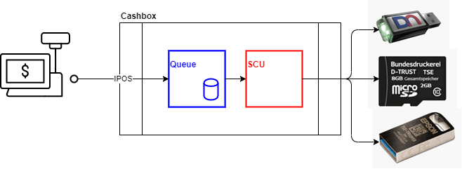

# Lokal installierte Middleware

**Produktnummer:** 0003

Die fiskaltrust.Middleware bietet die Einbindung von TSE aller Hersteller an die Registrierkasse, sowie eine vereinfachte Umsetzung der Anforderungen der Digitalen Schnittstelle der Finanzverwaltung für Kassensysteme.

Die fiskaltrust.Middleware besteht aus 

- einer Launcher App zum Installieren der Middleware lokal auf dem Kassenrechner
- einem Middleware Dienstprogramm (Service/Daemon; läuft dauerhaft auf dem Kassenrechner)

## Voraussetzungen für den Betrieb

### Windows

Die fiskaltrust.Middleware läuft als Dienst auf allen Windows Plattformen ab Windows 7 in 32 + 64 bit.
Windows XP wird nicht unterstützt, da die gesetzliche Forderung der „sichern Systemumgebung“ nicht gegeben ist.

| Betriebssystem                      | Version           | C++ Runtime | .net Framework |         |           |
| ----------------------------------- | ----------------- | ----------- | -------------- | ------- | --------- |
|                                     | unterstützt       | benötigt    | inkludiert     | minimum | empfohlen |
| Windows XP                          | nicht unterstützt |             |                |         |           |
| Windows Vista                       | nicht unterstützt |             |                |         |           |
| Windows Server 2008                 | nicht unterstützt |             |                |         |           |
| Windows 7                           | 32 & 64           | 32 or 64    | 4.0            | SP1     | SP1       |
| Windows 7 SP1                       | 32 & 64           | 32 or 64    | 4.5            | 4.6.1   | 4.7.2     |
| Windows Server 2008 R2              | 32 & 64           | 32 or 64    | 4.0            | 4.6.1   | 4.7.2     |
| Windows 8                           | 32 & 64           | 32 or 64    | 4.5            | 4.6.1   | 4.7.2     |
| Windows Server 2012                 | 32 & 64           | 32 or 64    | 4.5            | 4.6.1   | 4.7.2     |
| Windows 8.1                         | 32 & 64           | 32 or 64    | 4.5.1          | 4.6.1   | 4.7.2     |
| Windows Server 2012 R2              | 32 & 64           | 32 or 64    | 4.5.1          | 4.6.1   | 4.7.2     |
| Windows 10 1507                     | 32 & 64           | 32 or 64    | 4.6            | 4.6.1   | 4.7.2     |
| Windows 10 IoT Enterprise 2015 LTSB | 32 & 64           | 32 or 64    | 4.6            | 4.6.1   | 4.7.2     |
| Windows 10 1511                     | 32 & 64           | 32 or 64    | 4.6.1          | 4.7.2   | 4.7.2     |
| Windows 10 1607                     | 32 & 64           | 32 or 64    | 4.6.2          | 4.7.2   | 4.7.2     |
| Windows Server 2016                 | 32 & 64           | 32 or 64    | 4.6.2          | 4.7.2   | 4.7.2     |
| Windows 10 IoT Enterprise 2016 LTSB | 32 & 64           | 32 or 64    | 4.6.2          | 4.7.2   | 4.7.2     |
| Windows 10 1703                     | 32 & 64           | 32 or 64    | 4.7            | 4.7.2   | 4.7.2     |
| Windows 10 1709                     | 32 & 64           | 32 or 64    | 4.7.1          | 4.7.2   | 4.7.2     |
| Windows 10 1803-1809                | 32 & 64           | 32 or 64    | 4.7.2          | 4.7.2   | 4.7.2     |
| Windows Server 2019                 | 32 & 64           | 32 or 64    | 4.7.2          | 4.7.2   | 4.7.2     |
| Windows 10 1903-1909                | 32 & 64           | 32 or 64    | 4.8            | 4.8     | 4.8       |
| Windows 10 IoT Enterprise 2019 LTSC | 32 & 64           | 32 or 64    | 4.8            | 4.8     | 4.8       |

### Linux

Die fiskaltrust.Middleware kann auf verschiedenen Linux-Varianten als Deamon betrieben werden.

### Android

Die fiskaltrust.Middleware für Android befindet sich in Entwicklung.

## Features

### Schnittstellentechnologien

freie Auswahl folgender konfigurierbarer Schnittstellentechnologien:

- WCF
- GRPC
- REST

Schnittstellendokumentation: https://github.com/fiskaltrust/interface-doc/blob/master/doc/general/communication/communication.md

### Datenspeicher

Folgende Optionen sind über die Konfiguration der Queue einstellbar:

- Lokale Speicher:
  - [SQLite-Storage](../features/SQLite-Storage.md) 
  - [EF-Storage](../features/EF-Storage.md) 

- Cloud Speicher:
  -  [Azure-table-Storage](../features/Azure-table-Storage.md) 

### Daten Export

-  [TAR-File-Export](../../revisionssichere-daten-as-a-service/features/TAR-File-Export.md) 
-  [DSFinV-K-Export](../../revisionssichere-daten-as-a-service/features/DSFinV-K-Export.md) 
-  [revisionssichere-Queue-Items](../../revisionssichere-daten-as-a-service/features/revisionssichere-Queue-Items.md) 

### Abstraktion

- [SCU-Abstraktion](../features/SCU-Abstraktion.md)  
- [Queue-Abstraktion](../features/Queue-Abstraktion.md) 

### Interoperabilität

-  [TSE-A-Trust-Interoperabilität](../features/TSE-A-Trust-Interoperabilität.md) 
-  [TSE-Cryptovision-Interoperabilität](../features/TSE-Cryptovision-Interoperabilität.md) 
-  [TSE-Deutsche-Fiskal-Interoperabilität](../features/TSE-Deutsche-Fiskal-Interoperabilität.md) 
-  [TSE-Diebold-Nixdorf-Interoperabilität](../features/TSE-Diebold-Nixdorf-Interoperabilität.md) 
-  [TSE-Epson-Interoperabilität](../features/TSE-Epson-Interoperabilität.md) 
-  [TSE-Fiskaly-Interoperabilität](../features/TSE-Fiskaly-Interoperabilität.md) 
-  [TSE-Swissbit-Interoperabilität](../features/TSE-Swissbit-Interoperabilität.md) 