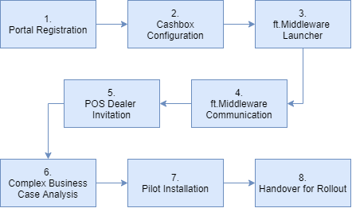

# Getting Started Guide for POS Creators

## Overview

This guide describes on a high level the stages, which a POS Creator should achieve, to ensure a successful completion of the journey, from the integration of the fiskaltrust.Middleware into the POS System, to a phase of pilot installations.

The success of this journey can be achieved through the completion of the following stages:

[1. Portal Registration](#1-portal-registration)
[2. Cashbox Configuration](#2-cashbox-configuration)
[3. Middleware Launcher](#3-middleware-launcher)
[4. Middleware Communication](#4-middleware-communication)
[5. POS Dealer Invitation](#5-pos-dealer-invitation)
[6. Complex Business Case Analysis](#6-complex-business-case-analysis)
[7. Pilot Installation](#7-pilot-installation)
[8. Handover for Rollout](#8-handover-for-rollout)

## Useful resources

Before proceeding with this guide, you may consider getting familiar with the content of the following useful resources:

- [POS Creator Lead Presentation](presentation/media/lead-presentation-creator-en.pptx)
- [POS Creator ft.Middleware Webinar Recording on YouTube](https://www.youtube.com/watch?v=mq1hHL8ezOg)

## 1. Portal Registration

### 1.1 Overview

The ft.Portal is a web application which offers features required to easily manage the functions necessary for the configuration and operation of your POS Systems. The ft.Portal is accessible via common Internet browsers, however, if your browser does not display some content correctly, or features are not available or not behaving as expected, try using the current version of Google Chrome.

There are 2 instances of fiskaltrust.Portal:

- Sandbox - [https://portal-sandbox.fiskaltrust.de](https://portal-sandbox.fiskaltrust.de/)
- Live - [https://portal.fiskaltrust.de](https://portal.fiskaltrust.de/)

**Note:** In order to receive the free support from fiskaltrust you must register in our live portal. The sandbox registration is needed for conducting test activities and does not qualify for support purposes!

### 1.2 Registration steps

The registration steps on both, the sandbox and the live portal, are identical. Simply complete the registration form, confirm your email, and sign the cooperation agreement.

### 1.3 Company data and cooperation agreement

As soon as you have registered in the portal, a form for selecting your role will be displayed. Select the option "POSCreator" and sign our cooperation agreement by entering your name in the input field. If you are also a POS dealer, please select that role as well.

By registering in the live portal and digitally signing our cooperation agreement, you are now entitled to access our free support for setup questions and onboarding. You can reach our POS Creator Support Team at <a href="mailto:support-poscreator@fiskaltrust.de">support-poscreator@fiskaltrust.de</a>.

## 2. CashBox Configuration

### 2.1 Overview

As a POS creator, your first goal is to be able to send requests to our free ft.Middleware from your POS system, and to be able to test your integration. The following sections summarize the configuration of a Cashbox and its components, which are required to achieve this goal.  

**Note:** All steps which are described in this document are for testing purposes, and, unless specifically stated otherwise, should be carried out in the Sandbox instance of the fiskaltrust.Portal.

### 2.2 CasBox

A so-called CashBox is a configuration container that connects (links) the configurations of individual components of the fiskaltrust.Middleware which can be configured in the fiskaltrust.Portal. The fiskaltrust.Portal can contain the configurations of Queues, SCUs, and various Helpers - and a CashBox connects them with each other. Next, we will configure an SCU and a Queue needed for testing, and then connect them together in the CashBox.

The steps for the creation and configuration of the Cashbox are covered in the [further part of this document](#25-cashbox-creation).

### 2.3 Configuration of the SCU

The SCU (Signature Creation Unit) is a component of the ft.Middleware, which is responsible for the communication with the TSE. Depending on which TSE you plan to use, the SCU will have to be configured accordingly.

To create an SCU configuration in the ft.Portal, select the menu item ``Configuration -> Signature creation unit`` and press the button "Create". Enter a short description (name) and select the package for your TSE at "Package Name". Then select the latest version under "Package Version" and press the button "Save".

Further configuration information is now required, and it may vary depending on the previously selected TSE package. In general, you specify here how the SCU can reach the TSE, and the endpoint via which the Queue will communicate with the SCU.

In the upper section of this form you can specify how the SCU can reach the selected TSE (the fields depend on the selected TSE type):

- **Cryptovision** - Enter the device path, the drive letter followed by the colon to which you have connected the TSE. For example ``E:``

- **Swissbit** - Enter the device path, the drive letter followed by the colon to which you have connected the TSE. For example ``E:``

- **Diebold - Nixdorf** - Enter the com port to which you have connected the TSE. For example ``COM6``

- **Epson** - Under revision.

- **Fiskaly TSE** - Enter the TSS ID, API key and the "Secret" key. Alternatively, you can purchase a free trial Fiskaly TSE in our sandbox portal shop. This will automatically create a SCU with the corresponding data for you. Note: Select the outlet in the shop before you add the test Fiskaly TSE to your shopping cart (outlet drop-down in the upper area).

To specify the communication endpoint for reaching the SCU, select, for example, the "gRPC" by pressing the corresponding button in the lower part of the form . The input field is filled in automatically and can be edited further if necessary. For the goal of this document, the automatically filled gRPC endpoint is sufficient.

Save the configuration of your SCU after entering the required data. In the next step we will configure the Queue.

### 2.4 Configuration of the Queue

The Queue is a component of the fiskaltrust.Middleware which collects the received data from the POS System and is responsible for creating the request chain. It is the component of the fiskaltrust.Middleware with which your POS system communicates. You send your data to it and receive signatures (and other data) back.

Under the menu item ``Configuration -> Queue`` you will find the button for creating a new Queue. Press this button to get to the input form. Enter a short description (name) and the CashboxIdentification. The CashboxIdentification will later be used by the SCU as clientID for the TSE. It is therefore important to enter a "printable string" with a maximum of 20 characters.

After saving, a form appears in which you can specify the communication endpoint. We will use this later for the communication with the queue. For our example we can choose http(REST) by pressing the corresponding button.

After saving, we are done with the configuration of the Queue and can now create the CashBox (our configuration container) in the next step.

### 2.5 CashBox creation

Under the menu item ``Configuration -> CashBox`` you will find the button to create a new CashBox. Press this button to get to the input form. After entering a short description (name) press the "Save" button. The CashBox has been created and now appears in the list.

#### 2.5.1 Connecting CashBox with Queue and SCU

Next, we want to put the configuration of the Queue and SCU into the created CashBox and connect them to each other. To do this, press the button with list symbol assigned to the CashBox.

Here you can now select the previously created Queue and SCU using the corresponding checkboxes and then save your selection. In the following we will connect the Queue with the SCU. To do this, expand the list entry of the new Cashbox in the overview of the CashBoxes. The detail area shows the contained configurations. Two buttons are assigned to the Queue configuration on the right. Press the first button (box and arrow symbol) to assign the new SCU to the Queue.

A popup appears in which you can select the SCU. After assigning and saving we are done with the configuration of our CashBox.

## 3. Middleware Launcher

The ft.Middleware Launcher starts the required services on the local machine, and exposes the endpoint configured for the Queue to the communication with your POS System.

### 3.1 Downloading the launcher

Before downloading the launcher **it is important that you "rebuild" the CashBox**. To do this, press the "Rebuild configuration" button (first grey button with reload symbol) in the CashBox line. **This action must be performed every time you change the configuration of the CashBox or one of its components**.

After rebuild you can now download the launcher. The download of the launcher is initiated by clicking the button "Download .NET Launcher" (globe symbol).

### 3.2 Enabling debug mode

When the download is completed, you will receive a zip file containing the launcher, its corresponding configuration, and other required files. Now, unpack the zip file and in the newly unzipped folder locate a ``test.cmd`` file, which we will edit. Open it with an editor of your choice and add the argument `` -verbosity=Debug`` at the end of the second line (which starts with ``fiskaltrust.exe``). This will give us more detailed log output later. Now save and close the ``test.cmd`` file.

### 3.3 Starting the launcher

The launcher must be started in the Administrator mode. You can start the launcher by right-clicking on the ``test.cmd`` file, and selecting "Run as Administrator". A terminal will appear where you can follow the start of the local middleware via log messages. This window remains open and visualizes log messages for further progress. Do not click into the inner area of the window, because this will pause the service (Windows feature). If this happens to you by mistake, click again and press "Enter" to cancel the interruption.

**Known issues / recommendations:**

- To prevent folder access issues during the start of the Launcher, it's best to extract the files to a "neutral" location, e.g. ``C:\Launcher\``. Starting the Launcher from one of the current user's folders may result in ``Access denied`` error.
- To prevent system permission issues when starting the Launcher, it's best to start the command prompt as Administrator, navigate to the folder containing Launcher's files, and start it from there.
- In case of a failed launch due to the port being used by another process, you may be required to change the port of the Queue's endpoint. In such case you'll have to rebuild the Cashbox, download the Launcher again, and then retry the start it. If that fails a system restart may help.

## 4. Middleware Communication

### 4.1 Initialization with an initial operation receipt

After starting the launcher, the local middleware is available. Next, we will initialize the launcher using an initial operation receipt. To help you understand this (and other) operations, we have prepared a Postman collection with several examples of simple requests and complex business cases. You can start our Postman collection directly from our fiskaltrust [middleware-demo-postman](https://github.com/fiskaltrust/middleware-demo-postman) github repo.

#### 4.1.1 Configuration of the Postman collection

Once the Postman collection loads, it must still be configured to send requests to the previously started local middleware. To do this, select the "fiskaltrust Middleware" collection, go to "Edit", and select the "Variables" tab. Here we find the two variables that are important for us: ``base_url`` and ``cashbox_id``. We need to modify those values as follows:

- **base_url** - here we specify the URL of the previously created http(REST) endpoint of the Queue. The required value can be found in the portal under the menu item ``Configuration -> Queue`` . Expand the detail area of the list entry of our Queue and copy the URL from there. For example ``rest://localhost:1500/f84bf516-a17b-4432-afa6-8c1050e2854d`` . Now replace ``rest://`` with ``http://`` in the URL to get the value for the Postman ``base_url`` variable. Example ``http://localhost:1500/f84bf516-a17b-4432-afa6-8c1050e2854d``. Now enter this value in Postmman for the variable ``base_url`` as ``CURRENT_VALUE``.

- **cashbox_id** - here we must specify the ID of our configuration container (not to be confused with the CashboxIdentification). We can find the value for the ``cashbox_id`` in the portal under the menu item ``Configuration -> CashBox``. To do so, expand the detail area of the list entry of our CashBox and copy the value of **CashBoxId**. For example ``90682627-f707-45ab-84df-f855118bba97``. Now enter this as the value of the variable ``cashbox_id`` under ``CURRENT_VALUE`` in the Postman collection.

Press ``Update`` to save your changes.

#### 4.1.2 Send a request with the initial operation receipt

In our Postman collection you will find an entry with the name ``Initial Operation Receipt``.  Click on it and select the ``Body`` tab to view its contents. You can now send the request by pressing the ``Send`` button. The request will be sent to the local middleware and you will get the response of the middleware back, which is displayed in Postman. In the terminal you can view the corresponding log messages. The ft.SecurityMechanism of the middleware and the TSE are now initialized and wait for further requests.

### 4.2 Sending further requests

### 4.2.1 Interface doc

The interface to the middleware is described in our [interface-doc](https://github.com/fiskaltrust/interface-doc/) Github repository. The fiskaltrust interface-doc repo contains important information and descriptions about the communication with the middleware. The [doc](https://github.com/fiskaltrust/interface-doc/tree/master/doc) folder contains a general part (directory ``general``) and country specific parts that specify the general part in more detail depending on the country. It is important that you read this interface description in order to be able to make further steps.

### 4.2.2 Postman collection

In the Postman collection mentioned above there are many more examples of requests that you can analyze and execute. After you have familiarized yourself with the interface description [interface-doc](https://github.com/fiskaltrust/interface-doc/) we recommend our [webinar video](https://www.youtube.com/watch?v=mq1hHL8ezOg&t=15s) on the middleware in which we explain the examples and have collected and demonstrated further important information for you.

## 5. POS Dealer Invitation

Once you were able to successfully establish a communication with the fiskaltrust.Middleware by sending simple requests and receiving correct expected responses, you are now ready to start engaging your POS Dealers into discussion about the details of the specific implementation of your POS System, and agree on the suitable rollout scenarios.

### 5.1 Invitation Process

To assist you with the invitation of the POS Dealers, we have automated the invitation process in our ft.Portal. Simply navigate to ``PosSystems`` and click on ``Add``. Next, provide the ``Designation``, ``Brand``, and ``Type`` for your POS System, select its ``Cash Register Type``, and save the data. Once the POS System has been created, find it on the list of available POS Systems and click the ``PosDealer`` button, which will open the list of connected PosDealers. Next, click ``Add``, provide the email of the POS Dealer whom you'd wish to invite, and click ``Search``. If the POS Dealer is already registered in the ft.Portal you will have the option to assign that company to your POS System. If no data of that POS Dealer has been found in the system,you will be presented with the ``Company Registration Form``. Completing the form will result in an invitation email sent to the POS Dealer. Such email will contain a link allowing to complete the registration process within the ft.Portal.

### 5.2 Rollout Scenarios

As the approach to the rollout highly depends on the implementation, the components, and the capabilities of your POS System, you should select the appropriate rollout scenario and discuss it with your POS Dealers, to ensure their sufficient levels of knowledge and understanding required for the successful execution of the rollout process.

The rollout has 2 separate areas, sales and technical, which both have been covered by the [presentations available for download](https://docs.fiskaltrust.cloud/doc/productdescription-de-doc/for-posdealers/prepare-rollout-presentations-de.html) from our documentation portal.

- **sales** - in this stage the POS Dealers should acquire the knowledge about the fiskaltrust products, and can immediately start purchasing and reselling the entitlements for the fiskaltrust products to the POS Operators via the ft.Portal.

- **technical** - this stage requires a close collaboration of the technical experts from both sides: yours and the POS Dealer's. You will discuss the details of the implementation, agree on the approach to templating, and select the best strategy for the rollout based on the appropriate rollout scenario. We have documented the [rollout scenarios](https://docs.fiskaltrust.cloud/doc/productdescription-de-doc/for-posdealers/02-pre-sales/rollout-scenarios.html) in our documentation portal.

### 5.3 Templating

A ``Template``, which can be created in the ft.Portal, contains the details of a pre-configured CashBox with all its components. Such templates can be used to automate, and therefore to speed-up the rollout process.
You can find the [details of the automation and templating](https://docs.fiskaltrust.cloud/doc/productdescription-de-doc/for-posdealers/02-pre-sales/automatisierter-rollout.html) in our documentation portal.

## 6. Complex Business Case Analysis

Each industry may have several specific and complex business cases which require a special handling in terms of requests sent to the ft.Middleware. If you require assistance establishing the proper handling of such complex business cases in the implementation of your POS System, please write us an email to our POS Creator support mailbox at <a href="mailto:support-poscreator@fiskaltrust.de">support-poscreator@fiskaltrust.de</a>, and one of our experts will be happy to assist you.

## 7. Pilot Installation

Once the rollout strategy has been selected and the approach to templating has been agreed, it's time for the POS Dealer to test it with selected POS Operator(s). Such pilot installation(s) should provide you with sufficient feedback, to allow early identification of problems and their possible resolutions, before approaching the mass rollout to multiple POS Operators.

## 8. Handover for Rollout

Once all previous stages have been completed, all preparations are done, the communication with ft.Middleware works, the rollout strategy has been agreed, and the pilot installation(s) have been successfully executed, you are now ready to handover the rollout to your POS Dealers.
The goal of this stage is about reaching an agreement with the POS Dealers that they are ready to start the rollout to the POS Operators.

## Further sources of information

- German fiskaltrust website: [https://fiskaltrust.de](https://fiskaltrust.de/)
- fiskaltrust documentation portal: [https://docs.fiskaltrust.cloud](https://docs.fiskaltrust.cloud/)
- FAQ: [fiskaltrust docs - faq](https://docs.fiskaltrust.cloud/doc/faq/qna/market-de.html) and [Github faq repo](https://github.com/fiskaltrust/faq) for creating issues (questions).
- fiskaltrust gihub repos: [https://github.com/fiskaltrust](https://github.com/fiskaltrust)
- fiskaltrust videos: [Youtube Channel](https://www.youtube.com/channel/UCmMlqO4L3AzkEhh6WYA8BJg)

