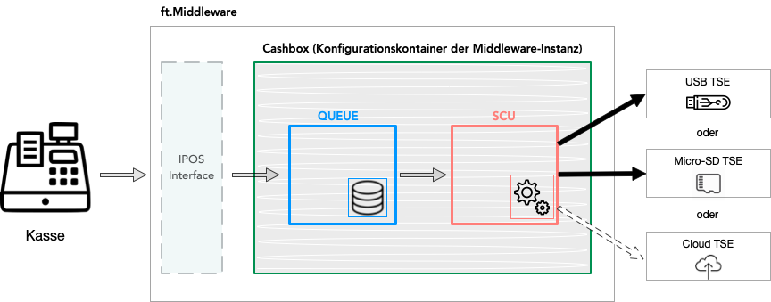
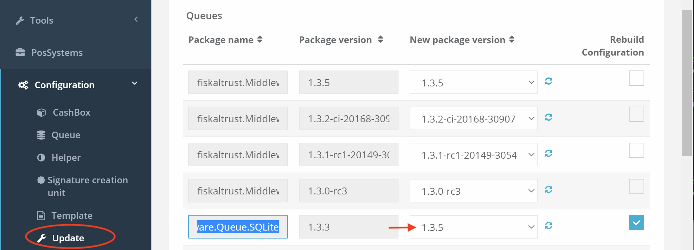
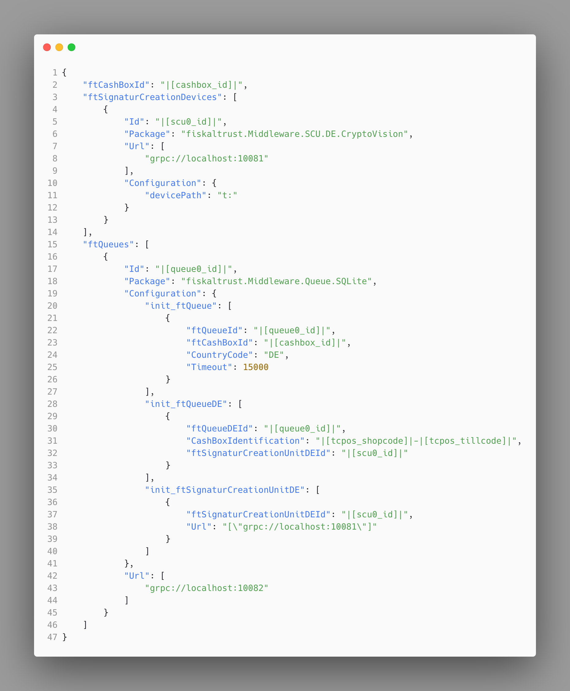
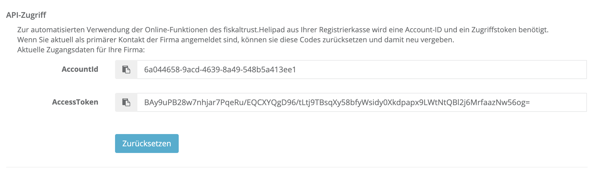

# Rollout Optimierung durch Automatisierung

Dieses Dokument soll Kassenhändler beim Rollout-Prozess unterstützen indem es Möglichkeiten der Vereinfachung und Optimierung des Rollouts durch Automatisierung aufzeigt. 

## Einleitung

Jede fiskaltrust.Middleware Instanz wird mit einer sogenannten Cashbox konfiguriert. Dieser Konfigurationscontainer wird zusammen mit der fiskaltrust.Middleware beim Kassenbetreiber ausgerollt. Dazu wird zum Beispiel der Launcher aus dem Portal heruntergeladen und in der Kasse gestartet. Der Launcher beinhaltet die fiskaltrust.Middleware und deren Konfiguration in Form einer Cashbox. Die Cashbox beinhaltet hauptsächlich die Konfigurationen der Queue und der SCU kann aber auch Helperkonfigurationen beinhalten. 





In den enthaltenen Konfigurationen sind zum Beispiel Kommunikations-Endpunkte, Datenbankzugriff, TSE-Zugriff usw. definiert. Im Normallfall wird eine solche Cashbox pro Kasse benötigt. Ein Rollout mit vielen Kassen ist daher bei einer manuellen Vorgehensweise sehr zeitintensiv da grundsätzlich für jede Kasse eine eigene Cashbox im Portal angelegt und editiert werden muss. Des Weiteren muss der Launcher heruntergeladen werden und in der Kasse ausgeführt werden. 

Um diesen Prozess zu optimieren stellt fiskaltrust diverse Tools zur Verfügung. Eine zentrale Rolle spielen dabei die Möglichkeit des Templating zum Anlegen von Cashboxen und die Möglichkeit zum automatisierten Ausführen der Templates mit Hilfe der fiskaltrust Portal-API. 

Im Folgenden gehen wir auf diese und andere Möglichkeiten der Optimierung ein und zeigen auf, wie Sie als Kassenhändler je nach Bedarf davon Gebrauch machen können.


## Überblick manueller Prozess

Wie bereits in der Einleitung erwähnt wird grundsätzlich pro Kasse eine Cashbox benötigt. Im Normalfall wird hier die Konfiguration einer Queue und einer SCU vorgenommen und diese werden 
miteinander verknüpft. 

Es existieren auch andere Szenarien (siehe dazu [Rollout-Szenarien](rollout-scenarios.md) ) auf die wir jedoch erst später eingehen. Die Konfiguration der Cashbox ist im [Getting Started Guide](../../for-poscreators/getting-started-en.md) für Kassenhersteller beschrieben.

Sobald die Cashbox für die Kasse im Portal angelegt, konfiguriert und zusammengestellt wurde, kann der Launcher aus dem Portal bereits heruntergeladen werden und auf der Kasse gestartet werden. Sobald der Launcher zum ersten mal gestartet wird, wird die enthaltene Konfiguration angewendet. Dadurch ist die Middleware bereit und wird im nächsten Schritt vom Launcher gestartet. 

D.h. im manuellen Prozess sind beim Rollout mindestens folgende initialen Schritte für jede Kasse vorzunehmen:

1. Anlegen und Konfiguration der Queue
2. Anlegen und Konfiguration der SCU
3. Verknüpfen der Queue mit der SCU
4. Erstellen und konfigurieren der Cashbox
5. Rebuild Configuration für die Cashbox (Zusammenbauen/Aktualisieren der Cashbox)
6. Download des Launcher
7. Starten des Launcher

Möchte man später die Konfiguration updaten (z.B. eine neue SCU Package Version verwenden), dann sind folgende Schritte vorzunehmen:

1. Update der betroffenen Konfiguration im Portal  (z.B. SCU Konfiguration)
2. Rebuild Configuration für die Cashbox im Portal (Zusammenbauen/Aktualisieren der Cashbox)
3. Stoppen der Middleware und Neustart des Launchers an der Kasse. 

Der Launcher lädt daraufhin automatisch die neue Version der Cashbox, wendet diese an und startet die Middleware mit der neuen Konfiguration.

Bei einer großen Menge von Kassen sind sowohl der initiale Rollout als auch ein Update sehr zeitaufwendig, wenn sie mit Hilfe der oben beschriebenen, manuellen Prozessen vorgenommen werden. 


## Massenupdate über das Portal

Für einen Massenupdate bereits ausgerollter Cashboxen stellt fiskaltrust unter dem Portalmenüpunkt ```Konfiguration -> Update``` die Möglichkeit zur Verfügung viele der Cashboxen gleichzeitig zu aktualisieren. 

Wird zum Beispiel eine neue Package Version des Persistenzlayer benötigt, so kann diese für alle betroffenen Cashboxen gleichzeitig aktualisiert werden:





Im oben dargestellten Screenshot wird für alle Queues mit der `fiskaltrust.Middleware.Queue.SQLite` Package Version 1.3.3 die Konfiguration auf die Version 1.3.5 upgedatet. Zusätzlich werden automatisch die entsprechenden Cashboxen aktualisiert und zusammengebaut (siehe Rebuild Configuration checkbox rechts).


## Templating zum Anlegen von Cashboxen

Beim Templating besteht die Möglichkeit mit Hilfe eines Konfigurations-Template automatisiert Checkboxen für den Kassenbetreiber anzulegen. Es wird dafür ein Template vorbereitet und für den Kassenbetreiber im Portal hinterlegt. Daraufhin erscheint das Template im fisklatrust.Webshop innerhalb des Accounts des Kassenbetreibers als kostenloses Produkt. Es kann dort in beliebiger Menge ausgecheckt werden. Die Menge stellt dabei die Anzahl der Cashboxen dar, die automatisch generiert werden sollen. Sobald der Checkout-Prozess abgeschlossen ist, wird vom Portal durch Anwendung des Templates die entsprechende Anzahl von Cashboxen automatisch generiert und im Account des Kassenbetreiber hinterlegt. 

Im Folgenden werden die einzelnen Schritte des oben beschriebenen Prozess detailliert dargestellt.

### Erstellung und Inhalte des Konfigurations-Template

Das Template ist ein JSON String der eine parametrisierbare Variante der Cashbox (Konfigurationskontainer als JSON String) darstellt und somit die Konfigurationen von Queues, SCUs und Helper beinhalten kann. Parametrisierbar ist es insofern, dass hier die Struktur für die zu generierende Cashbox definiert werden kann (z.B. fünf Queues, eine SCU). Zudem können bei den Werten Variablen als Platzhalter eingesetzt werden können. Sobald die Generierung der daraus resultierenden Cashbox stattfindet, werden die Variablen mit konkreten, finalen Werten befüllt.

Im folgenden Bild wird ein Beispiel eines solchen Template visualisiert - download unter [template1.json](media/template1.json)



Variablen werden gekennzeichnet indem sie innerhalb von ```|[``` und  ```]|``` angegeben werden. Möglich hierbei ist sowohl die Angabe von [Systemvariablen](#systemvariablen) deren Werte vom fiskaltrust System bei der Generierung erzeugt werden als auch die Angabe eigener Variablen deren Werte später über einen API Aufruf zum Generieren der Cashbox übergeben werden können (siehe auch [Parametrisierung des API Aufrufs](#parametrisierung)). 

In Zeile 1 des obigen Beispiel wird die Systemvariable: ```|[cashbox_id]|```  als Wert für ```"ftCashBoxId"``` angegeben. Hierbei geht es um die CashboxID, einem Wert, der automatisch von dem System erzeugt wird und beim Generieren der Cashbox an dieser Stelle eingesetzt wird.

In Zeile 31 werden hingegen eigene Variablen verwendet (```|[my_shopcode]|``` und ```|[my_tillcode]|``` ) deren konkrete Werte später beim API Aufruf übergeben werden können. 

Wie ebenfalls in Zeile 31 zu sehen ist, können die JSON String Werte aus einer Kombination von Variablen und statischen Teilen bestehen. Sie können aber auch nur statischen "Text" beinhalten oder auch nur eine Variable.

Folgende Tabellen zeigen die möglichen Inhalte (Datenstruktur) eines Template:

| **Fieldname**        | **Pflicht**              | **Inhalt**          | **Beschreibung**          |
|----------------------|--------------------------|--------------------------|---------------------|
| `ftCashBoxId` |ja | ```GUID String``` | Identifiziert die Cashbox im fiskaltrust System und muss daher eindeutig sein. Wird später ein Teil der Authentifizierung der Registrierkasse mit fiskaltrust. Die Systemvariable ```|[cashbox_id]|```  kann hier verwendet werden um den Wert bei Generierung der Cashbox von fiskaltrust automatisch zu erzeugen und einzusetzen. |
| `ftSignaturCreationDevices` |nein | `PackageConfiguration [ ]` | Array, beinhaltet die Konfigurationen der zu verwendenden SCUs |
| `ftQueues` |nein | `PackageConfiguration [ ]` | Array, beinhaltet die Konfigurationen der zu verwendenden Queues |
| `helpers` |nein | `PackageConfiguration [ ]` | Array, beinhaltet die Konfigurationen der zu verwendenden Helper |
| `TimeStamp` |nein | ```DateTime.UtcNow.Ticks``` | Zeitpunkt der  Erstellung des Template|

Ein **`PackageConfiguration`** Objekt ist wie folgt aufgebaut:

| **Fieldname**        | **Pflicht**              | **Inhalt**          | **Beschreibung**          |
|----------------------|--------------------------|--------------------------|---------------------|
| `Id` |ja |  ```GUID String```  | Identifiziert die Instanz des Elements, das hier konfiguriert wird (SCU, Queue oder Helper). Für die Queue kann die Systemvariable `queue{0-9}_id` verwendet werden. Für die SCU kann hier die Systemvariable `scu{0-9}_id` zum Einsatz kommen. Für Helper  `helper{0-9}_id`. |
| `Package` |ja | ```String``` | Name des Package das zum Erstellen des Elements verwendet werden soll. Z.B. `fiskaltrust.Middleware.SCU.DE.CryptoVision` für eine SCU, die mit einer Cyptovision-TSE kommunizieren soll. Aktuell unterstützte Packages finden sie weiter unten. |
| `Version` |nein |  ```String```| Version des Package das zum Erstellen des Elements verwendet werden soll. Wenn keine Version angegeben wird, so wird die neueste Version verwendet.|
| `Configuration` |nein | `<String, Object>`| Konfigurationsparameter des Elements. Z.B. Laufwerkbuchstabe der TSE bei der Cryptovision SCU, damit der SCU bekannt ist wie sie auf die TSE zugreifen soll. Je nach Element-Typ zu befüllen. Siehe unten. |
| `URL` |ja | `String []` | Array, Kommunikationsendpunkte des Elements. Z.B. REST Endpunkt für die Kommunikation mit der Queue. |

**Queue**
Folgende Packages stehen aktuell für Queues zur Verfügung:

| **Package Name**        | **Beschreibung**          |
|----------------------|----------------------|
| `fiskaltrust.Middleware.Queue.SQLite` |Eine SQLite Datenbank wird als lokaler Persistenzlayer verwendet. |
| `fiskaltrust.Middleware.Queue.EF` |Entity Framework wird als lokaler Persistenzlayer verwendet. |
| `fiskaltrust.Middleware.Queue.MySQL` | Eine MySQL Datenbank wird als lokaler Persistenzlayer verwendet. |

Folgende Schlüssel-Wert Paare werden in dem **`Configuration`** Objekt einer Queue verwendet:

| **Fieldname**        | **Pflicht**              | **Inhalt**          | **Beschreibung**          |
|----------------------|--------------------------|--------------------------|---------------------|
| `init_ftQueue` |ja |  ```Configuration``` | Initialisierungsparameter für die Queue (allgemeiner Teil der Queue Konfiguration).|
| `init_ftQueueDE` |ja |  ```Configuration``` | Initialisierungsparameter für die Queue (länderspezifischer Teil der Queue Konfiguration).|
| `init_ftSignaturCreationUnitDE` |nein |  ```Configuration``` | Initialisierungsparameter zum Verknüpfen der Queue mit einer SCU. Hier werden Verbindungswerte hinterlegt.|
| `connectionstring` |nein |  ```String``` | Verbindungsstring zum Persistenzlayer. Beispiel siehe unten. Bei SQLite kann dieses Feld weggelassen werden wenn keine eigene Datenbank vorhanden ist. In diesem Fall legt fiskaltrust automatisch eine SQLite Datenbank an. |

Beispiel für einen `connectionstring` bei Verwendung von Entity Framework:

`Data Source=.\\!sql-instanz!;Initial Catalog=!fiskaltrust!;User ID=!user!;Password=!password!;MultipleActiveResultSets=True` 

Beispiel für einen `connectionstring` bei Verwendung von MySQL:

`Server=myServerAddress;Database=myDataBase;Uid=myUsername;Pwd=myPassword;` 

Beispiel für einen `connectionstring` bei Verwendung von SQLite:

`Data Source=c:\mydb.db;Version=3;Password=myPassword;` 

Folgende Schlüssel-Wert Paare werden in dem **`Configuration` **Objekt einer Queue im Feld **`init_ftQueue`**  verwendet:

| **Fieldname**        | **Pflicht**              | **Inhalt**          | **Beschreibung**          |
|----------------------|--------------------------|--------------------------|---------------------|
| `ftQueueId` |ja |  ```GUID String``` | Identifikation der Queue. Die Systemvariable `queue{0-9}_id` kann verwendet werden.|
| `ftCashBoxId` |ja |  ```GUID String``` | Identifikation  der Cashbox. Die Systemvariable ```|[cashbox_id]|```  kann hier verwendet werden.|
| `CountryCode` |ja |  ```String``` | Länderkürzel. Für Deutschland: "DE".|
| `Timeout` |nein |  ```Int``` | Timeout in Millisekunden. |

Folgende Schlüssel-Wert Paare werden in dem **`Configuration`** Objekt einer Queue im Feld **`init_ftQueueDE`**  verwendet:

| **Fieldname**        | **Pflicht**              | **Inhalt**          | **Beschreibung**          |
|----------------------|--------------------------|--------------------------|---------------------|
| `ftQueueDEId` |ja |  ```GUID String``` | Identifikation der Queue. Die Systemvariable `queue{0-9}_id` kann verwendet werden. (Hier muss der gleiche Wert wie bei `ftQueueId` verwendet werden.) |
| `CashBoxIdentification` |ja |  ```printable String (20)``` | Kassenseriennummer. Wird auch als Client-ID für die TSE verwendet. Printable String, max. 20 Zeichen.|
| `ftSignaturCreationUnitDEId` |ja |  ```GUID String```  | Die ID der SCU mit der sich diese Queue verbinden soll.|

Folgende Schlüssel-Wert Paare werden in dem **`Configuration`** Objekt einer Queue im Feld **`init_ftSignaturCreationUnitDE`**  verwendet:
| **Fieldname**        | **Pflicht**              | **Inhalt**          | **Beschreibung**          |
|----------------------|--------------------------|--------------------------|---------------------|
| `ftSignaturCreationUnitDEId` |ja |  ```GUID String``` | Identifikation der SCU mit der sich diese Queue verbinden soll. Die Systemvariable `scu{0-9}_id` kann verwendet werden. |
| `Url` |ja |  ```String``` | Kommunikationsendpunkte der SCU. Als Array im String Bsp: ```"[\"grpc://localhost:10081\", \"grpc://localhost:10082\"]"```. Normalerweise wird nur ein Endpunkt benötigt. |

**SCU**

Folgende Packages stehen aktuell für SCUs zur Verfügung:

| **Package Name**        | **Beschreibung**          |
|----------------------|----------------------|
| `fiskaltrust.Middleware.SCU.DE.CryptoVision` | Dieses Package ermöglicht die Kommunikation mit einer Cryptovision TSE.|
| `fiskaltrust.Middleware.SCU.DE.DieboldNixdorf` | Dieses Package ermöglicht die Kommunikation mit einer Diebold Nixdorf TSE.|
| `fiskaltrust.Middleware.SCU.DE.Epson` | Dieses Package ermöglicht die Kommunikation mit einer Epson TSE.|
| `fiskaltrust.Middleware.SCU.DE.Fiskaly` | Dieses Package ermöglicht die Kommunikation mit eine Fiskaly TSE.|
| `fiskaltrust.Middleware.SCU.DE.Swissbit` | Dieses Package ermöglicht die Kommunikation mit einer Swissbit TSE. |

Folgende Schlüssel-Wert Paare werden in dem **`Configuration`** Objekt einer **SCU** je nach Hersteller der TSE verwendet:

**Swissbit TSE**
| **Fieldname**        | **Pflicht**              | **Inhalt**          | **Beschreibung**          |
|----------------------|--------------------------|--------------------------|---------------------|
| `devicePath` |ja |  ```String``` | Laufwerksbuchstabe gefolgt von Doppelpunkt (z.B. `E:`). Repräsentiert das Laufwerk an dem die Swissbit TSE an der Kasse angeschossen wird. |
| `adminPin` |nein |  ```String``` | Admin PIN. Nur anzugeben wenn es sich um eine außerhalb von fiskaltrust initialisierte TSE handelt. Falls die TSE noch nicht initialisiert ist, wird dieser Wert nicht benötigt.|
| `timeAdminPin` |nein |  ```String``` | Time Admin PIN. Nur anzugeben wenn es sich um eine außerhalb von fiskaltrust initialisierte TSE handelt. Falls die TSE noch nicht initialisiert ist, wird dieser Wert nicht benötigt.|

**Cryptovision TSE**
| **Fieldname**        | **Pflicht**              | **Inhalt**          | **Beschreibung**          |
|----------------------|--------------------------|--------------------------|---------------------|
| `devicePath` |ja |  ```String``` | Laufwerksbuchstabe gefolgt von Doppelpunkt (z.B. `E:`). Repräsentiert das Laufwerk an dem die Cryptovision TSE an der Kasse angeschossen wird. |
| `adminPin` |nein |  ```String``` | Admin PIN. Nur anzugeben wenn es sich um eine außerhalb von fiskaltrust initialisierte TSE handelt. Falls die TSE noch nicht initialisiert ist, wird dieser Wert nicht benötigt.|
| `timeAdminPin` |nein |  ```String``` | Time Admin PIN. Nur anzugeben wenn es sich um eine außerhalb von fiskaltrust initialisierte TSE handelt. Falls die TSE noch nicht initialisiert ist, wird dieser Wert nicht benötigt.|

**Diebold Nixdorf**
| **Fieldname**        | **Pflicht**              | **Inhalt**          | **Beschreibung**          |
|----------------------|--------------------------|--------------------------|---------------------|
| `comPort` |ja (nur USB) |  ```String``` | Definiert den Com Anschluß an, an dem die TSE angeschlossen wird. Zum Beispiel `COM6`. Nur zu verwenden wenn es sich um eine USB-TSE ohne Connect Box handelt. |
| `url` |ja (nur Connect Box) |  ```String``` | Verbindungs-Url falls es sich um eine Diebold Nixdorf Connect Box handelt. |
| `adminUser` |nein |  ```String``` | Admin Username. Nur anzugeben wenn es sich um eine außerhalb von fiskaltrust initialisierte TSE handelt. Falls die TSE noch nicht initialisiert ist, wird dieser Wert nicht benötigt.|
| `adminPin` |nein |  ```String``` | Admin PIN. Nur anzugeben wenn es sich um eine außerhalb von fiskaltrust initialisierte TSE handelt. Falls die TSE noch nicht initialisiert ist, wird dieser Wert nicht benötigt.|
| `timeAdminUser` |nein |  ```String``` | Time Admin Username. Nur anzugeben wenn es sich um eine außerhalb von fiskaltrust initialisierte TSE handelt. Falls die TSE noch nicht initialisiert ist, wird dieser Wert nicht benötigt.|
| `timeAdminPin` |nein |  ```String``` | Time Admin PIN. Nur anzugeben wenn es sich um eine außerhalb von fiskaltrust initialisierte TSE handelt. Falls die TSE noch nicht initialisiert ist, wird dieser Wert nicht benötigt.|
| `slotNumber` |ja (nur Connect Box) |  ```Int``` | Slot-Nummer der TSE falls hierbei eine Diebold Nixdorf Connect Box verwendet wird. |

**Epson** 

| **Fieldname**        | **Pflicht**              | **Inhalt**          | **Beschreibung**          |
|----------------------|--------------------------|--------------------------|---------------------|
| `tseurl` |ja |  ```String``` | Url zum Verbinden mit der TSE. Hier wird die TSE erreichbar sein |
| `tseport` |nein |  ```String``` | Port zum Verbinden mit der TSE. Hier wird die TSE erreichbar sein|
| `deviceid` |nein |  ```String``` | Device Id beim Epson Server.|
| `timeout` |nein | Int | Timeout in Millisekunden |

**Fiskaly**

| **Fieldname**        | **Pflicht**              | **Inhalt**          | **Beschreibung**          |
|----------------------|--------------------------|--------------------------|---------------------|
| `apiKey` |ja |  ```String``` | Fiskaly API Schlüssel |
| `apiSecret` |ja |  ```String``` | Fiskaly API Secret |
| `tssId` |ja |  ```GUID String``` | ID der TSE von Fiskaly |

### Systemvariablen

Folgende Systemvariablen stehen Ihnen zur Verwendung im Template zur Verfügung:

| Variable                                  | Wert                                                         |
| ----------------------------------------- | ------------------------------------------------------------ |
| `outlet_number`                           | `{max(outlets used in account's existing cashboxes) + 1}`    |
| `description`                             | `ft{yyyyMMddHHmmss}`                                         |
| `cashbox_description`                     | `ft{yyyyMMddHHmmss}`                                         |
| `cashbox_id`                              | Random GUID                                                  |
| `cashbox_ipaddress`                       | Empty string                                                 |
| `scu{0-9}_id`                             | Random GUID                                                  |
| `scu{0-9}_description`                    | `{description}`                                              |
| `scu{0-9}_url`                            | `net.pipe://localhost/{scu_id}`                              |
| `helper{0-9}_id`                          | Random GUID                                                  |
| `helper{0-9}_description`                 | `{description}`                                              |
| `helper{0-9}_url`                         | `net.pipe://localhost/{helper_id}`                           |
| `queue{0-9}_id`                           | Random GUID                                                  |
| `queue{0-9}_id_base64withoutspecialchars` | `{queue_id}`, converted to Base64 without special characters |
| `queue{0-9}_description`                  | `{description}`                                              |
| `queue{0-9}_url`                          | `http://localhost:1200/fiskaltrust` for the first queue, `http://localhost:1200/fiskaltrust{1-9}` for others |

_Dynamische Werte werden in dieser Tabelle durch {} hervorgehoben._


### Zur Verfügung stellen des Konfigurations-Template über das Portal

Kassenhersteller, Kassenhändler und Kassebbetreiber können Konfigurations-Templates im fiskaltrust.Portal ablegen und freigeben. Dies können sie unter dem Menüpunkt `Konfiguration->Templates` vornehmen. 

Das Template selbst (JSON String) wird dabei im das Formularfeld `Content`  hinterlegt.

Beim Anlegen des Template kann gewählt werden an welche Zielgruppe das Template freigegeben werden soll. 

Optionen für **Kassenhersteller**:

| **Option**        | **Beschreibung**          |
|----------------------|----------------------|
| `Deaktiviert` | Keine Freigabe, Template befindet sich noch in Vorbereitung oder wurde pausiert. |
| `Privat (nur Besitzer)` | Freigabe nur für dem Kassenhersteller selbst (z.B. zum Testen) |
| `Geteilt mit Händler` | Freigabe für den Kassenhersteller selbst und für alle mit ihm verbundenen Kassenhändler. |
| `Getielt mit Betreiber` | Freigabe für den Kassenhersteller selbst und für alle mit seinen Kassenhändler verbundenen Kassenbetreiber.|

Optionen für **Kassenhändler**:

| **Option**        | **Beschreibung**          |
|----------------------|----------------------|
| `Deaktiviert` | Keine Freigabe, Template befindet sich noch in Vorbereitung oder wurde pausiert. |
| `Privat (nur Besitzer)` | Freigabe nur für dem Kassenhändler selbst (z.B. zum Testen). |
| `Getielt mit Betreiber` | Freigabe für den Kassenhändler selbst und für alle mit ihm verbundenen Kassenbetreiber.|

Optionen für **Kassenbetreiber**:

| **Option**        | **Beschreibung**          |
|----------------------|----------------------|
| `Deaktiviert` | Keine Freigabe, Template befindet sich noch in Vorbereitung oder wurde pausiert. |
| `Privat (nur Besitzer)` | Freigabe nur für dem Kassenbetreiber selbst. |

Des Weiteren kann das Template mit einem Bild und Link personalisiert werden. Da später das Template im fiskaltrust.Webshop für freigegebene Accounts erscheint, wird durch dieses Branding eine besseren Erkennung ermöglicht.

Stellt der Kassenhersteller ein Template für seine Kassenhändler zur Verfügung, so können diese das Template klonen, eventuell anpassen und als neues Template ihren Kassenbetreibern zur Verfügung stellen.


### Manuelles Ausführen des Konfigurations-Template

Sobald ein Template für einen Account freigeben wurde, so erscheint dieses als kostenloses Produkt im fiskaltrust.Webshop innerhalb des freigegebenen Account. Der Account-Besitzer kann das Template nun in beliebiger Menge auschecken. Die Menge stellt dabei die Anzahl der Cashboxen dar, die automatisch generiert werden sollen. Sobald der Checkout-Prozess abgeschlossen ist, wird vom Portal durch Anwendung des Templates die entsprechende Anzahl von Cashboxen automatisch generiert und im Account bei den Konfigurationen hinterlegt (Menüpunkt: `Konfiguration->Cashbox`). 

Handelt es sich hierbei um den Account eines Kassenbetreibers, besteht die Möglichkeit je nach Outlet unterschiedliche Templates auszuchecken. Deshalb sollte vor der Übernahme des Templates in den Warenkorb auf die Standortauswahl geachtet werden (Auswahl: Standort-Dropdown oben links im Shop).

Unter bestimmten Umständen kann der Kassenhändler selbst für den Kassenbetreiber das Auschecken des Template vornehmen. Dies stellt eine zeitsparende Optimierung dar, die es Kassenhändlern ermöglicht beim Rollout ohne das Zutun des Kassenbetreibers zu operieren. Dafür benötig jedoch der Kassenhändler eine generelle Erlaubnis des Kassenbetreibers zur sog. "Surrogating Funktion". Mit dieser Funktion kann der Kassenhändler in den Account des Kassenbetreiber switchen.

### FAQ: Template nur für einen Kunden

Eine häufig gestellte Frage in diesem Kontext ist, ob ein Template auch nur für einen bestimmten Kunden (Kassenbetreiber) zur Verfügung gestellt werden kann. Um dies zu erreichen, kann der Kassenhändler mit der "Surrogating Funktion" in den Account des Kassenbetreiber wechseln und dort unter das Template anlegen und mit der Freigabestufe `Privat (nur Besitzer)` freigeben. Somit wird dieses Template über den fiskaltrust.Webshop nur im Account dieses Kassenbetreibers sichtbar.


## Nutzung von API oder PowerShell zum automatisierten Ausführen der Templates


fiskaltrust stelle eine HTTP-API zur Verfügung mit der Sie die Automatisierung der Cashboxgenerierung mit Hilfe von Konfigurations-Templates vornehmen können. Im diesem Kapitel wird die API beschrieben und ein Aufruf am Beispiel PowerShell vorgeführt.

### API
Die Ausführung von Templates kann über unsere HTTP-API leicht automatisiert werden. Sie benötigen dazu das Template als JSON String, die AccountId und den AccessToken des Accounts (z.B. des Kassenbetreibers) für den das Template ausgeführt werden soll. AccountId und Accesstoken finden Sie im fiskaltrust.Portal innerhalb des entsprechenden Account (Menüpunkt: [`Firmanname -> Übersicht`](https://portal.fiskaltrust.de/AccountProfile) im unteren Bereich befindet sich die Sektion `API Zugriff`).



Ihr Request sollte wie folgt aussehen:

- _Method_: **POST**
- _Headers_: 
  - `accountid`: `<your-account-id>`
  - `accesstoken`: `<your-access-token>`
- _Body_: JSON template
- _URLs_: 
  - Sandbox: `https://helipad-sandbox.fiskaltrust.cloud/api/configuration`
  - Production: `https://helipad.fiskaltrust.cloud/api/configuration`

#### Parametrisierung

Zusätzlich können Variablen zum Query-String der URL hinzugefügt werden, die dann automatisch im Template ersetzt werden.  Ändern Sie beispielsweise die obige URL auf den Wert:

`https://helipad.fiskaltrust.cloud/api/configuration?my_variable=123` 

so werden vor dem Ausführen des Template die Vorkommnisse `|[my_variable]|` mit dem String  `123`  ersetzt.

Falls nicht über den Query-String überschrieben, werden [Systemvariablen](#systemvariablen) im Template wie oben beschrieben automatisch vom System ersetzt.

#### Antwort

Als Antwort gibt die API einen JSON String zurück, der die `cashboxid` der angelegten Cashbox, den `accesstoken` und das Template beinhaltet. Die erhaltene `cashboxid` ist wichtig für die vollständige Automatisierung des Rollout. Siehe dazu auch [Automatisierter Rollout der fiskaltrust.Middleware](#automatisierter-rollout-der-fiskaltrust.middleware).

### PowerShell

Das folgende Beispiel zeigt wie mit Hilfe der PowerShell der Request an unsere API gesendet werden kann:

```powershell
$headers = @{ accountid = "your-account-id" ; accesstoken = "your-access-token" }
$uri = "https://helipad-sandbox.fiskaltrust.cloud/api/Configuration"
# Read from template.json and escape JSON string
$template = (Get-Content .\template.json -Raw).Replace('\', '\\').Replace('"', '\"')

Invoke-WebRequest -uri  $uri -Headers $headers -Method POST -ContentType "application/json" -Body "`"$template`""
```

### Handling von Standorten/Outlets

Wie weiter oben bereits erwähnt, kann das Auschecken von Templates mit dem Standort des Kassenbetreibers verknüpft werden. In diese Kapitel wird aufgezeigt wie diese Funktion automatisiert über die API vrogenommen werden kann.

#### Anlegen oder Importieren der Outlets im Portal

Standorte (sogenannte Outlets) können manuell über das Portal im Account des Kassenbetreibers angelegt werden. Siehe Menüpunkt `Outlets` . Des Weiteren kann als Optimierungsvariante unter dem selben Menüpunkt mit Hilfe einer csv. Datei eine ganze Liste von Standorten importiert werden. Der Aufbau einer solchen Liste ist im Portal beschrieben.

Das Anlegen der Standorte ist nur über das Portal möglich und kann nicht über die API erfolgen.

#### Angabe des Outlets im API Aufruf

Über den Parameter `outlet_number` kann im Query-String die Outlet-Nummer angebenen werden für die das Template ausgeführt werden soll:

`https://helipad-sandbox.fiskaltrust.cloud/api/configuration?outlet_number=12`

### Beispiel automatisiertes Ausführen verschiedener Templates unter Berücksichtigung der Outlets

Powershell:

```powershell
$headers = @{ accountid = "163c4ac7-46e1-e911-a838-000d3a289110" ; accesstoken = "BFYqg87qyOp0yfZ8qIA/2PdqkRzUIn+xZQkjZQaHum10XnVHXfBQpdtVUjcIx9xDvM7SQRfk2J9pJAc0mQtzx3I="  }

$outlets = Import-Csv -Path .\fiskaltrustOutletsWithTemplateFile.csv -Delimiter ';'

foreach ($outlet in $outlets)
{
    $template = (Get-Content .\$($outlet.Template) -Raw).Replace('\', '\\').Replace('"', '\"')

    $uri = "https://helipad-sandbox.fiskaltrust.cloud/api/configuration?description=$([uri]::EscapeDataString($outlet.Name))&outlet_number=$([uri]::EscapeDataString($outlet.OutletNumber))&my_shopcode=$($outlet.OutletNumber)&my_tillcode=$($outlet.TillCode)"

    Write-Output $uri
    Invoke-WebRequest -uri  $uri -Headers $headers -Method POST -ContentType "application/json" -Body "`"$template`""
}
```
Schritt 1: Header definieren (accountId und accesstoken setzen)

Schritt 2: Outlets aus der [`fiskaltrustOutletsWithTemplateFile.csv`](media/fiskaltrustOutletsWithTemplateFile.csv) Datei einlesen. Diese Datei wird sowohl für das Anlegen der Outlets (Import im Portal) als auch zum Ausführen der Templates verwendet. Nach dem Import im Portal wird sie hier eingelesen. Beispielhafter Inhalt:

`
LocationId;OutletNumber;Name;Address;ContactName;Telephone;Fax;PostalCode;City;County;StateOrProvince;Country;Template;TillCode
;15;Outlet 5;street address5;;;;80803;München;;;DE;template1.json;till1
;16;Outlet 6;street address6;;;;80803;München;;;DE;template2.json;till2
;17;Outlet 7;street address7;;;;80803;München;;;DE;template1.json;till3
`

Schritt 3: Iteration über die eingelesenen Zeilen aus der Outlet Datei.

Schritt 4: für jede eingelesene Zeile wird das entsprechende Template eingelesen und vorbereitet. Z.B. für Zeile 1 wird der Inhalt der Datei [`template1.json`](media/template1.json) eingelesen. In Zeile 2 wird für ein anderes Outlet ein anderes Template [`template2.json`](media/template2.json) benötigt.

Schritt 5: für jede eingelesene Zeile wird die Uri für den API Aufruf aufgebaut. Hierbei wird die Outlet Nummer als Parameter im Query-String übergeben.

Schritt 6: für jede eingelesene Zeile wird ein Aufruf der HTTP-API mit dem zuvor vorbereiteten Header, Uri und Template abgesetzt.

Zusammenfassung: In dem obigen Beispiel wurden mit Hilfe der [`fiskaltrustOutletsWithTemplateFile.csv`](fiskaltrustOutletsWithTemplateFile.csv) Datei sowohl die Outlets im Portal angelegt (Bulk-Import) als auch für jedes Outlet das dazugehörige Template (einmalig - als Beispiel) ausgeführt.

## Automatisierter Rollout der fiskaltrust.Middleware

Die fiskaltrust Launcher steht Ihnen als [Nugget-Package](https://www.nuget.org/packages/fiskaltrust.service.launcher/) frei zur Verfügung. Dadurch können Sie den Launcher downloaden, seine Konfiguration anpassen und als Teil Ihres Rollouts automatisiert auf die Kassen der Betreiber ausliefern und starten. 

Wichtig ist es hierbei beim ersten Start darauf zu achten, dass die fiskaltrust.Middleware richtig, d.h. mit der dazugehörigen Cashbox initialisiert wird. Dafür stellt der Launcher ein Konfigurationsfile (fiskaltrust.exe.config) zur Verfügung. Dieses können Sie vor dem Ausrollen des Launcher auf die Kasse des Betreibers entsprechend anpassen. 

Bitte geben Sie dazu in dem Bereich `appSetting` die Werte für `cashboxid` und `accesstoken` an. Diese Werte erhalten Sie als Rückgabewerte des [API Aufruf](#antwort) zum Ausführen des Konfigurations-Template.

```xml
<configuration>
<appSettings>
  <add key="cashboxid" value="3cf85e5e-95f7-4fcd-bed1-0867fd8d55ee" />
  <add key="accesstoken" value="BL3BxJfIOMMGE9Zu+aKvp5s0c6qEDfn2s6y5wrSYYm9pMMQa/jYZvlvm9YFE3+96WmqJ5jWIM9axt3Tyi3X2ptY=" />
```
Nun können Sie den Launcher mit der angepassten Konfigurationsdatei auf die Kasse des Betreibers ausliefern und mit `fiskaltrust.exe` starten. Der Launcher wird sich automatisch die Cashbox (Konfigurationscontainer) zur in `fiskaltrust.exe.config` angegebenen `cashboxid`  vom fiskaltrust Server herunterladen und die fiskaltrust.Middleware entsprechend konfigurieren und starten.

## Hoher Automatisierungsgrad

Durch die oben beschriebene Vorgehensweisen zum Ausführen der Konfigurations-Templates über die API und zum automatisierten Rollout der fiskaltrust.Middleware ist ein hoher Automatisierungsgrad des Rollouts erreichbar. Lediglich die Outlets müssen mit Hilfe des Bulk-Import im Portal manuell angelegt werden.
