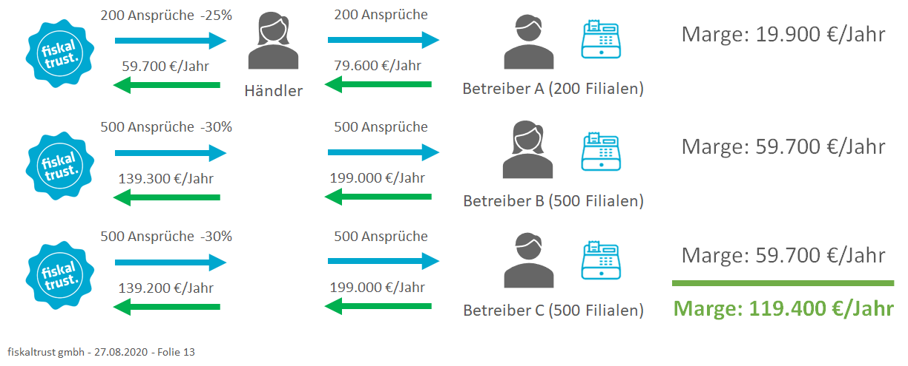
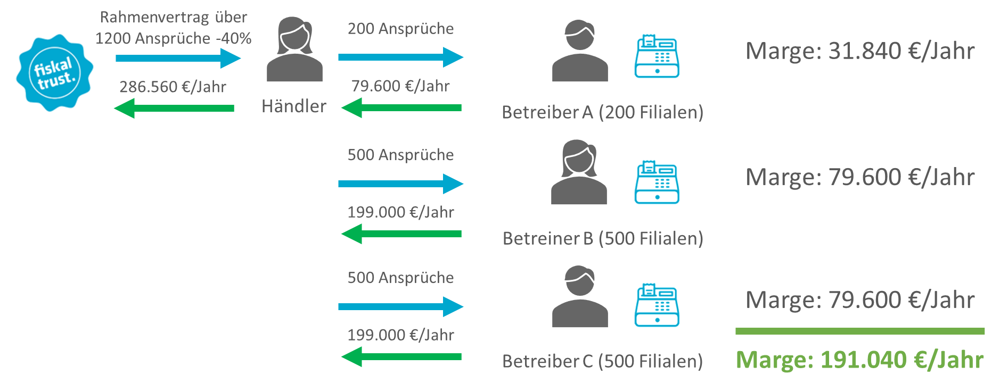

# Entitlements ("Ansprüche")

Entitlements („Ansprüche“) sind Gutscheine für bestimmte Produkte und stellen für Kassenhändler die Möglichkeit dar, bestmögliche Mengenrabatte zu erzielen:

In der oben abgebildeten Grafik wird beschrieben, wie ein Kassenhändler in drei getrennten Schritten für jeweils drei seiner Kunden Produkte bei fiskaltrust einkaufen kann, um diese an seine Kunden (Kassenbetreiber) weiterzuverkaufen.

Im ersten Vorgang erhält der Händler einen Mengenrabatt von 25% für den Einkauf von 200 Produkt-Einheiten, die in Form von Ansprüchen seinem Kundenkonto im Portal gutgeschrieben werden. Durch den Weiterverkauf dieser Ansprüche an seinen Kunden "Betreiber A" im Rahmen des empfohlenen Verkaufspreises erwirtschaftet der Händler eine Marge von 19.900 €/Jahr.

Der Händler kauft als nächstes für einen weiteren Kunden (Betreiber B) 500 Ansprüche ein und erhält darauf einen Mengenrabatt von 30%. Der Händler erwitschaftet durch den Weiterverkauf der 500 Ansprüche eine Marge von 59.700 €/Jahr.

Gleiches gilt für den dritten und letzten Vorgang dieses Beispiels. 

Am Ende erwirtschaftet der Händler eine Marge von 119.400 €/Jahr als Summe der drei dargestellten Vorgänge.

## Bündelung von Ansprüchen für höheren Mengenrabatt

Bündelt der Kassenhändler die Einkäufe im oben dargestellten Beispiel mit Hilfe eines Rahmenvertrags, erhält er bessere Einkaufskonditionen. Dies wird in der nächsten Abbildung dargestellt:

In diesem Fall ermittelt der Händler den Bedarf an Produkt-Einheiten vorab bei all seinen Kunden und schließt mit fiskaltrust einen Rahmenvertrag über den Einkauf von 1.200 Produkt-Einheiten ab. Dadurch erhält er einen höheren Mengenrabatt von 40%.

Der Weiterverkauf der Produkte erfolgt analog zum ersten Beispiel. Die Marge beträgt nun jedoch 191.040 €/Jahr aufgrund der besseren Einkaufskonditionen.

## Voraussetzungen für den Bezug von Mengenrabatten

[Registrierung als Kassenhändler im Portal](voraussetzungen-einkauf.md)

[Abschluss von Rahmenverträgen](01-purchase-agreement.md)