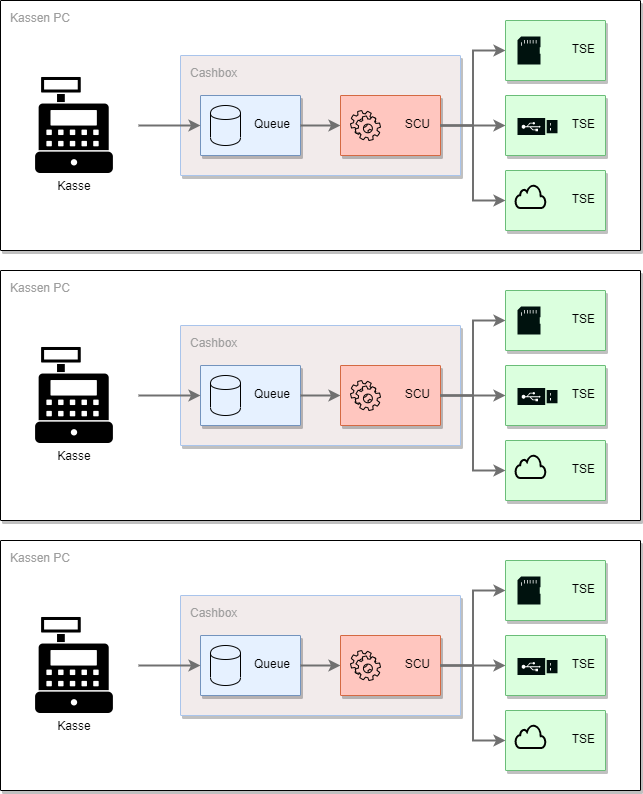
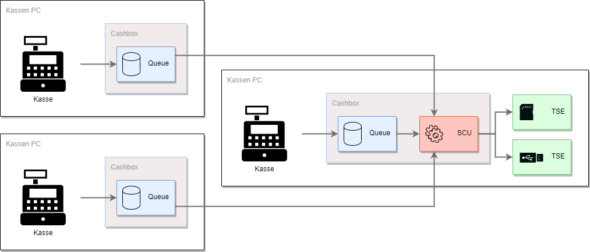
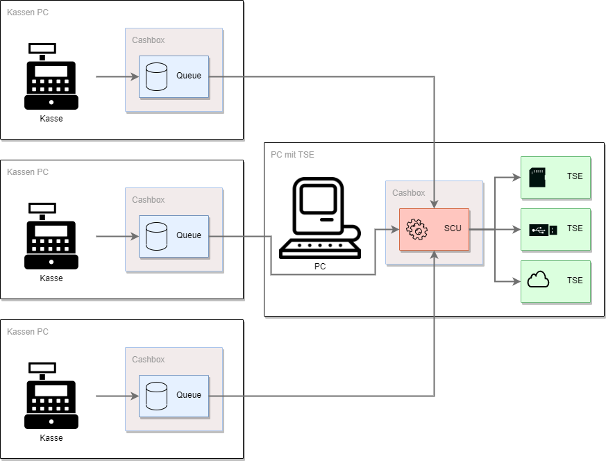
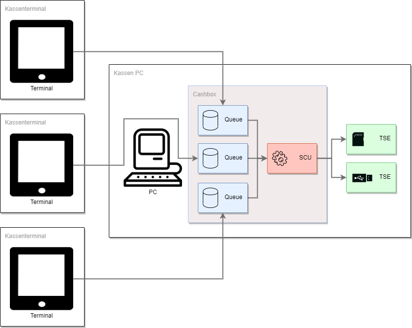
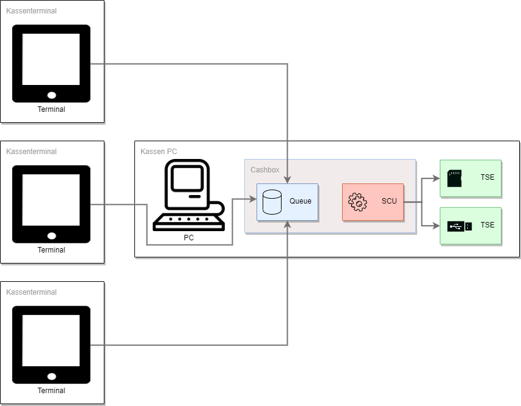
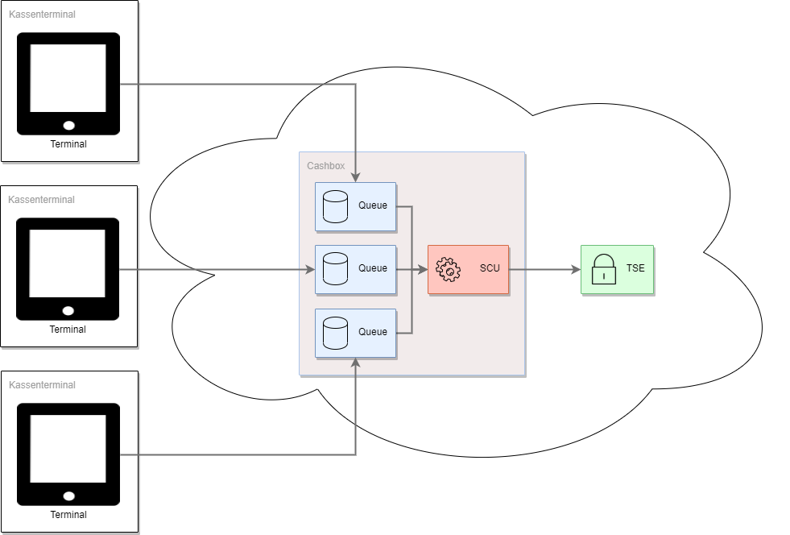

# Rollout Szenarien, Tipps & Tricks für DE
Um die fiskaltrust.Middleware in Verbindung mit Kassen und TSEs zu verwenden kommen unterschiedliche Szenarien in Frage. Bei jedem dieser Szenarien handelt es sich immer um einen Standort. Diese werden weiter unten erläutert, es gibt allerdings einige Grundvoraussetzungen welche auf jeden Fall gegeben sein müssen, unabhängig vom Szenario.

- Pro POS-System (Standort) muss mindestens eine [SCU](https://github.com/fiskaltrust/productdescription-de-doc/blob/master/product-service-description/compliance-as-a-service/features/SCU-Abstraktion.md) inkl. TSE zugeordnet sein. Die TSE kann entweder eine Hardware TSE vor Ort sein, oder eine zertifizierte Cloud TSE.
- Jede fiskaltrust.Queue (Kasse) muss dem Finanzamt gemeldet werden.
- Alle Komponenten müssen sich am gleichen Standort befinden, im sogenannten "operational environment" (sichere Einsatzumgebung).
- Jede Kasse kann nur eine TSE nutzen.

Es ist zudem jederzeit möglich weitere Terminals mit einer Kasse zu verbinden oder zusätzliche TSEs zu verwenden.

#### TSE in der Cloud
Mit einer Cloud TSE können diverse Komponenten der TSE in einem Rechenzentrum betrieben werden. Ist die TSE nicht mehr erreichbar, wechselt die fiskaltrust.Middleware in den [Ausfallsmodus](). Bei der Nutzung von Cloud TSEs möchten wir auf die [Fair-Use-Policy]() hinweisen.

#### Hardware-TSE
Pro Kasse kann nur eine Hardware-TSE angeschlossen werden. Entweder per SD-Karte oder am USB-Anschluss.

## TSE pro Kasse
Aus technischer Sicht ist es das einfachste Szenario, benötigt allerdings auch die maximale Anzahl an TSEs. Ein Vorteil dieser Lösung ist, dass die anderen Kassen weiterhin funktionsfähig sind sobald die TSE einer Kasse ausfällt. Ein weiterer Vorteil ist, da jede Kasse eine eigene TSE nutzt kann es hier nicht zu Performanceproblemen führen.

## Hauptkasse
An der Hauptkassa wird eine fiskaltrust.CashBox betrieben welche eine fiskaltrust.Queue und die SCU enthält und diese kommuniziert mit der TSE. Auf den anderen Kassen werden dennoch fiskaltrust.CashBoxen installiert, welche allerdings nur eine fiskaltrust.Queue haben und mit der SCU verbunden sind. Da hier nur eine TSE im Einsatz ist, muss die Hauptkasse immer laufen und die TSE erreichbar sein. Bei einer großen Anzahl an Requests pro Sekunde oder einer großen Anzahl an Kassen empfehlen wir den Einsatz einer oder mehreren zusätzlichen TSEs, hier gibt es mehr Informationen dazu: [Performance](#Performance).

## TSE am Server
Am Server wird eine fiskaltrust.CashBox betrieben welche die SCU enthält und diese kommuniziert mit der TSE. Auf den Kassen sind dennoch fiskaltrust.CashBoxen installiert, welche allerdings nur eine fiskaltrust.Queue haben und mit der SCU verbunden sind. Da hier nur eine TSE im Einsatz ist, muss der Server immer laufen und die TSE erreichbar sein. Bei einer großen Anzahl an Requests pro Sekunde oder einer großen Anzahl an Kassen empfehlen wir den Einsatz einer oder mehreren zusätzlichen TSEs, hier gibt es mehr Informationen dazu: [Performance](#Performance).

## Terminals
"Terminals" bedeutet, die Eingabegeräte sind Tablets oder ähnliches, das heißt es ist gar nicht möglich hier eine Hardware-TSE anzuschließen bzw. die fiskaltrust.Middleware am Gerät selbst zu installieren. In diesem Fall wird keine fiskaltrust.CashBox am Terminal installiert, sondern am Server oder einer Hauptkasse. Die Terminals dienen nur als Eingabegeräte und verbinden sich mit dem Server oder der Kasse. Jedes Terminal welches dem Finanzamt gemeldet werden muss, benötigt eine eigene fiskaltrust.Queue. Da hier nur eine TSE im Einsatz ist, muss der Server immer laufen und die TSE erreichbar sein. Bei einer großen Anzahl an Requests pro Sekunde oder einer großen Anzahl an Terminals empfehlen wir den Einsatz einer oder mehreren zusätzlichen TSEs, hier gibt es mehr Informationen dazu: [Performance](#Performance).

## Terminals mit Single-Queue
"Terminals" bedeutet, die Eingabegeräte sind Tablets oder ähnliches, das heißt es ist gar nicht möglich hier eine Hardware-TSE anzuschließen bzw. die fiskaltrust.Middleware am Gerät selbst zu installieren. In diesem Fall wird keine fiskaltrust.CashBox am Terminal installiert, sondern am Server oder einer Hauptkasse. Die Terminals dienen nur als Eingabegeräte und verbinden sich mit dem Server oder der Kasse. Wenn die Terminals nicht dem Finanzamt gemeldet werden müssen, reicht eine fiskaltrust.Queue aus. Da hier nur eine TSE im Einsatz ist, muss der Server immer laufen und die TSE erreichbar sein. Bei einer großen Anzahl an Requests pro Sekunde oder einer großen Anzahl an Terminals empfehlen wir den Einsatz einer oder mehreren zusätzlichen fiskaltrust.Queues und TSEs, hier gibt es mehr Informationen dazu: [Performance](#Performance).

## Rechenzentrum als operational environment
Falls die Kasse in einem Rechenzentrum betrieben wird und die Eingabestationen ohne (Internet-)Verbindung zu diesem nicht funktionsfähig sind, kann das Rechenzentrum unter bestimmten Voraussetzungen als "operational environment" angenommen werden. Die fiskaltrust.Middleware kann in diesem Fall vollständig in diesem Rechenzentrum betrieben werden. In diesem Szenario verbinden sich die Terminals (Eingabestationen) zur fiskaltrust.Middleware im Rechenzentrum.
Im Falle eines Ausfalls der (Internet-)Verbindung ist es allerdings so, dass keine SignatureItems auf die Belege gedruckt werden können. Bei Interesse an einer Lösung, bei der fiskaltrust den Betrieb im Rechenzentrum des KassenBetreibers installiert und wartet, gibt es hier mehr Informationen: [info@fiskaltrust.de](mailto:info@fiskaltrust.de?subject=Informationen%20zu%20Bring-your-own-datacenter).

#### Performance
Wir empfehlen ab XY Requests pro Sekunde eine zusätzliche TSE.
Wir empfehlen ab XY Terminals eine zusätzliche TSE.
Wir empfehlen pro XY Terminals eine weitere fiskaltrust.Queue.