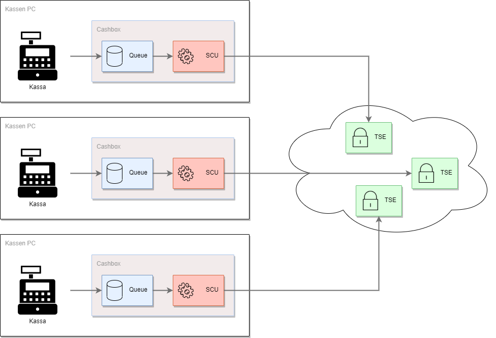

# Rollout Szenarien, Tipps & Tricks für DE
Um die fiskaltrust.Middleware in Verbindung mit Kassen und TSEs zu verwenden kommen unterschiedliche Szenarien in Frage. Diese werden weiter unten erläutert, es gibt allerdings einige Grundvoraussetzungen welche auf jeden Fall gegeben sein müssen, unabhängig vom Szenario.

- Pro POS-System (Standort) muss mindestens eine SCU inkl. TSE zugeordnet sein.
- Für jede Kassa die dem Finanzamt gemeldet werden muss, muss eine Queue zugeordnet sein.

## Hardware TSE

Die folgenden Szenarien erfordern jeweils mindestens eine Hardware TSE vor Ort.

### TSE pro Kasse
Das ist das technisch einfachste Szenario, benötigt allerdings auch die maximale Anzahl an TSEs. Technisch ist diese Lösung sehr einfach zu handhaben, da die Exporte der TSE ausschließlich direkt an der Kasse erfolgen.

### TSE pro Standort
Es ist auch möglich, für den gesamten Standort nur eine SCU inkl. TSE zu verwenden. An den Kassen sind dennoch CashBoxen installiert, welche allerdings nur eine Queue haben und mit der SCU-CashBox inkl. TSE verbunden sind. Es gibt zwei Möglichkeiten dieses Szenario zu realisieren. Die SCU-CashBox kann auf einer Kasse betrieben werden, oder auf einem separatem Rechner. Wichtig ist, dass sich alle Komponenten am gleichen Standort befinden, im sogenannten "operational environment" (sichere Einsatzumgebung). Bei diesen Szenarien ist darauf zu achten, dass die Exporte aller Kassen zentral auf einer TSE stattfinden und es beim Löschen der Daten zu Probleme führen kann.

SCU auf der Kasse|SCU separat
:--:|:--:
|

### Kassen/Terminals ohne CashBoxen
Werden die Kassen nur als Eingabeterminals verwendet, so ist es nicht notwendig eine CashBox an der Kasse zu installieren. Das ist auch möglich wenn es keine Kassen gibt, sondern nur Terminals (zum Beispiel Tablets) welches als Eingabeterminals fungieren. Dabei ist zu unterscheiden, ob die Terminals/Kassen dem Finanzamt gemeldet werden oder nicht. Werden sie nicht gemeldet kann alles in eine Queue laufen, ansonsten braucht man für jede Kasse/jedes Terminal eine Queue. 

Single Queue|Queue pro Terminal
:--:|:--:
|

## Cloud TSE

Die nachfolgenden Szenarien beschreiben die Verwendung einer zertifizierten Cloud TSE.

### TSE in der Cloud
Mit einer Cloud-TSE können diverse Komponenten der TSE in einem Rechenzentrum betrieben werden. Es ist hier prinzipiell möglich die CashBoxen, Queues und SCUs so wie in der vorherigen Szenarien abzubilden. Ist die TSE nicht mehr erreichbar, wechselt die fiskaltrust.Middleware in den Ausfallsmodus.

### Komplettlösung in der Cloud
Falls die Kasse in einem Rechenzentrum betrieben wird und die Eingabestationen ohne (Internet-)Verbindung zu diesem nicht funktionsfähig sind, kann das Rechenzentrum unter bestimmten Voraussetzungen als "operational environment" angenommen werden. Die fiskaltrust.Middleware kann in diesem Fall vollständig in diesem Rechenzentrum betrieben werden. In diesem Szenario verbinden sich die Terminals (Eingabestationen) zur fiskaltrust.Middleware im Rechenzentrum.
Im Falle eines Ausfalls der (Internet-)Verbindung ist es allerdings so, dass keine SignatureItems auf die Belege gedruckt werden können. Bei Interesse zur Lösung, bei der fiskaltrust den Betrieb im Rechenzentrum des KassenBetreibers installiert und wartet, gibt er hier mehr Informationen: [info@fiskaltrust.de](mailto:info@fiskaltrust.de?subject=Informationen%20zu%20Bring-your-own-datacenter).

