# Rollout Szenarien, Tipps & Tricks für DE
Um die fiskaltrust.Middleware in Verbindung mit Kassen und TSEs zu verwenden kommen unterschiedliche Szenarien in Frage. Bei jedem dieser Szenarien handelt es sich immer um einen Standort. Diese werden weiter unten erläutert, es gibt allerdings einige Grundvoraussetzungen welche auf jeden Fall gegeben sein müssen, unabhängig vom Szenario.

- Pro Standort muss mindestens eine [SCU](https://github.com/fiskaltrust/productdescription-de-doc/blob/master/product-service-description/compliance-as-a-service/features/SCU-Abstraktion.md) inkl. TSE zugeordnet sein. Die TSE kann entweder eine Hardware-TSE vor Ort sein, oder eine zertifizierte Cloud-TSE.
- Jede fiskaltrust.Queue muss dem Finanzamt als elektronisches Kasen- oder Aufzeichnungssystem (Kasse) gemeldet werden.
- Alle fiskaltrust.Queues, SCUs und TSEs müssen sich im sogenannten "operational environment" befinden. Eine Ausnahme stellt die Cloud-Komponente einer zertifizierten Cloud-TSE dar. Diese befindet sich im Rechenzentrum des Cloud-TSE Anbieters.
- Jeder fiskaltrust.Queue kann nur eine SCU zugeordnet werden. Jede SCU kann nur für eine TSE zuständig sein. D.h. jede Kasse kann nur eine TSE verwenden.
- Pro Kasse können mehrere Terminals betrieben werden. (Ein Terminal ist ein Gerät ohne Kassenfunktion).
- Der Wechsel und die Kombination der unten dargestellten Szenarien ist jederzeit möglich.

#### TSE in der Cloud
Bei einer Cloud-TSE läuft eine Komponente im Rechenzentrum des Cloud-TSE Anbieters. Ist diese TSE Komponente nicht mehr erreichbar, wechselt die fiskaltrust.Middleware in den Ausfallsmodus. Bei der Nutzung von Cloud-TSEs möchten wir zusätzlich auf unsere [Fair-Use-Policy](https://github.com/fiskaltrust/productdescription-de-doc/blob/master/for-posoperators/tse-fiskaly-fair-use-policy.md) hinweisen.

#### Hardware-TSE
Pro Kasse kann nur eine Hardware-TSE angeschlossen werden. Grundsätzlich per micro SD-Karte oder per USB-Anschluss.

## TSE pro Kasse
Aus technischer Sicht ist dies das einfachste Szenario, benötigt allerdings auch die maximale Anzahl an TSEs. Ein Vorteil dieser Lösung ist, dass wenn eine TSE ausfällt oder verloren geht, die anderen Kassen nicht betroffen sind. Ein weiterer Vorteil besteht darin, dass Performanceprobleme vermieden werden, weil jede Kasse ihre eigene TSE nutzt und somit nur die Requests dieser Kasse an die TSE gesendet werden.

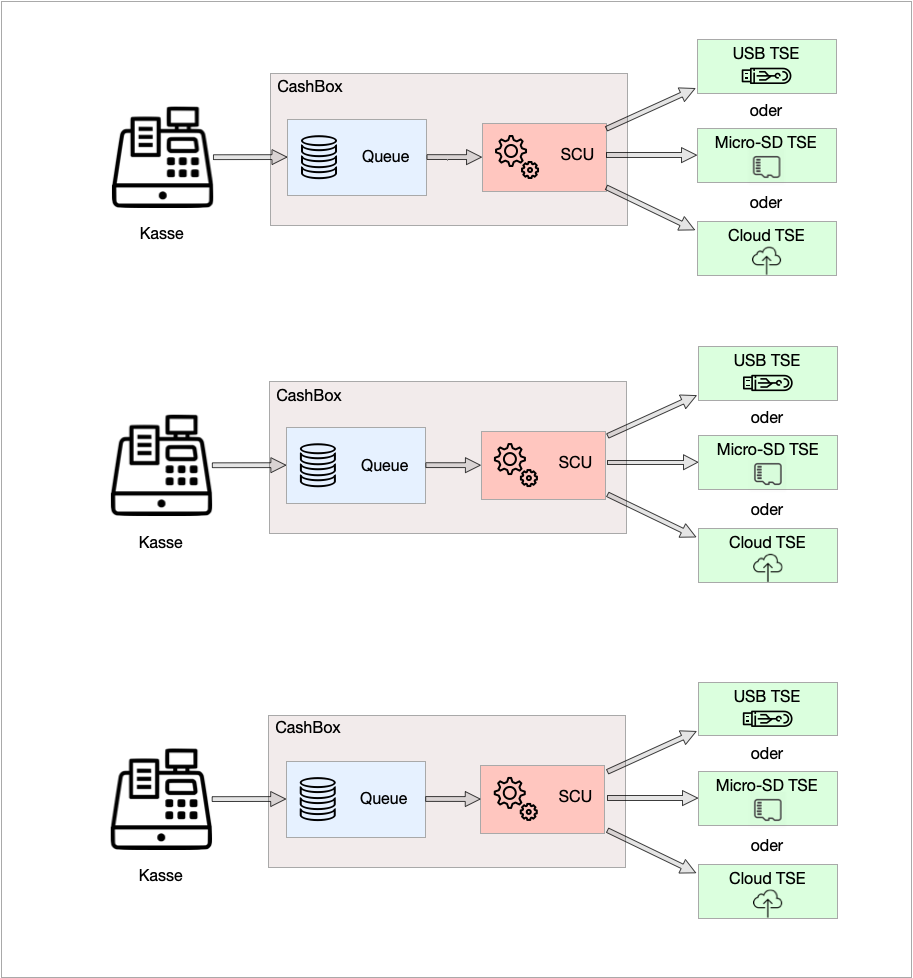

## Hardware-TSE am lokalen Server für mehrere Kassen
Auf jeder Kasse und auf dem lokalen Server läuft die fiskaltrust.Middleware. Die Hardware-TSE wird an den lokalen Server (z.B. per USB) angeschlossen. Die fiskaltrust.CashBox des Servers konfiguriert die fiskaltrust.Middleware mit einer SCU. Die für den Server konfigurierte SCU greift auf eine Hardware-TSE zu. Die fiskaltrust.CashBoxen der einzelnen Kassen sind so konfiguriert, dass deren fiskaltrust.Middleware nur mit einer fiskaltrust.Queue ausgestattet wird. Die hier eingesetzten fiskaltrust.Queues verbinden sich mit der SCU des Server. Dieses Szenario ermöglicht eine Einsparung von TSEs. Da jedoch hierbei alle Requests über die SCU des Server laufen müssen, wird der Server zum Bottleneck. Auch die TSE wird zum Bottleneck. Beim Ausfall des Server oder der TSE sind alle Kassen davon betroffen. Des Weiteren kann es in diesem Szenario zu Performanceengpässen in der Hardware-TSE kommen. 

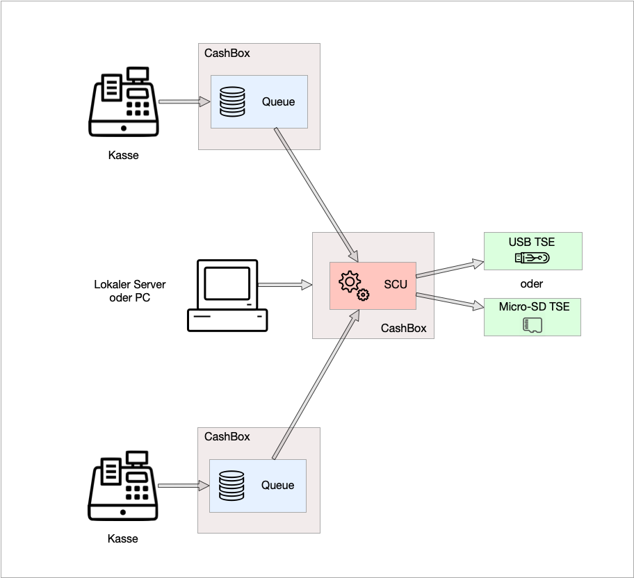

Sollten Sie sich für dieses Szenario entscheiden, empfehlen wir bei einer großen Anzahl von Requests den Einsatz einer oder mehrerer zusätzlichen TSEs. Dies wird im unteren Bild beispielhaft visualisiert.

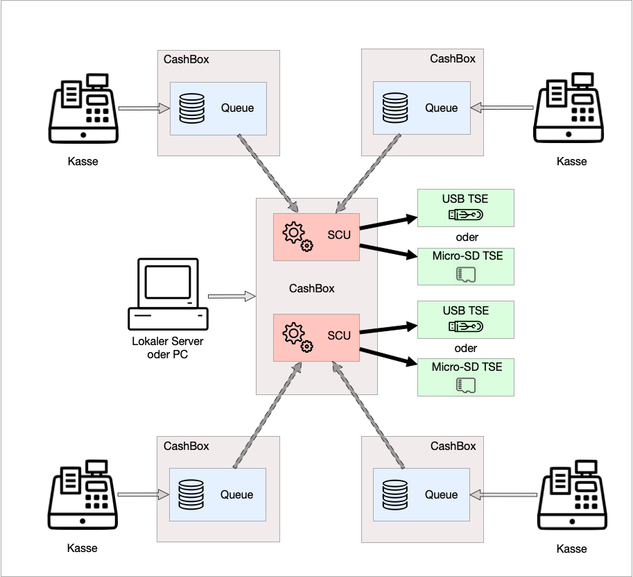

## Hardware-TSE an der Hauptkasse für mehrere zusätzliche Kassen
Auf jeder Kasse läuft die fiskaltrust.Middleware. Die fiskaltrust.CashBox der Hauptkasse konfiguriert die fiskaltrust.Middleware mit einer fiskaltrust.Queue und einer SCU. Die für die Hauptkasse konfigurierte SCU greift auf eine TSE zu. Die fiskaltrust.CashBoxen der anderen Kassen sind so konfiguriert, dass deren fiskaltrust.Middleware nur mit einer fiskaltrust.Queue ausgestattet wird. Die hier eingesetzten fiskaltrust.Queues verbinden sich mit der SCU der Hauptkasse. Dieses Szenario ermöglicht eine Einsparung von TSEs. Da jedoch hierbei alle Requests über die SCU der Hauptkasse laufen müssen, wird die Hauptkasse zum Bottleneck. Auch die Hardware-TSE wird zum Bottleneck. Beim Ausfall der Hauptkasse oder der Hardware-TSE sind alle anderen Kassen davon betroffen. Des Weiteren kann es in diesem Szenario zu Performanceengpässen in der TSE kommen. Sollten Sie sich für dieses Szenario entscheiden, empfehlen wir bei einer großen Anzahl von Requests den Einsatz einer oder mehrerer zusätzlichen TSEs.

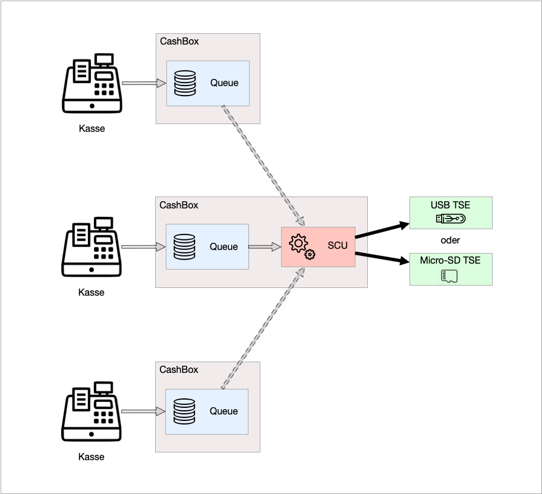

## Eine Cloud-TSE für mehrere Kassen
Auf jeder Kasse läuft die fiskaltrust.Middleware. Die fiskaltrust.CashBox jeder Kasse konfiguriert die fiskaltrust.Middleware mit einer eigenen fiskaltrust.Queue und einer eigenen SCU. Jede SCU greift auf die gleiche Cloud-TSE zu. Dieses Szenario ermöglicht eine Einsparung von Cloud-TSEs. Da jedoch hierbei alle Requests an die gleiche Cloud-TSE gesendet werden, wird die TSE zum Bottleneck. Des Weiteren sind hierbei ebenfalls sowohl mögliche Performanceengpässe in der Cloud-TSE zu berücksichtigen als auch unsere [Fair-Use-Policy](https://github.com/fiskaltrust/productdescription-de-doc/blob/master/for-posoperators/tse-fiskaly-fair-use-policy.md).

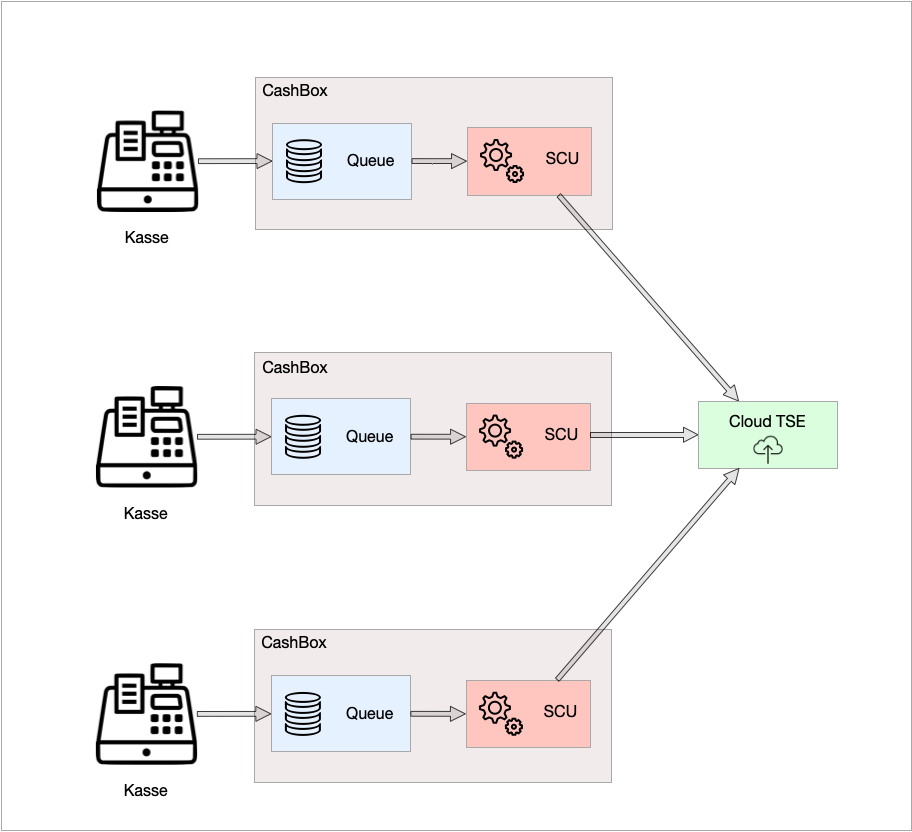

## Szenario mit Terminals
Terminals sind Eingabegeräte wie Tablets, Handhelds oder ähnliches (ohne Kassenfunktion), bei denen es nicht möglich ist eine Hardware-TSE anzuschließen bzw. die fiskaltrust.Middleware am Gerät selbst zu installieren. In diesem Fall wird die fiskaltrust.Middleware an einer Kasse oder an einem Server betrieben und sollte stets erreichbar sein. Die Terminals dienen nur als Eingabegeräte und verbinden sich mit dem Server oder mit der Kasse. Bei vielen gleichzeitigen Requests kann es zu Performanceengpässen in der TSE kommen.  Sollten Sie ich für dieses Szenario entscheiden, empfehlen wir bei einer großen Anzahl von Requests den Einsatz mehrerer Kassen mit zusätzlichen TSEs (alternativ: mehrere fiskaltrust.Middleware Instanzen mit eigener TSE auf dem Server).

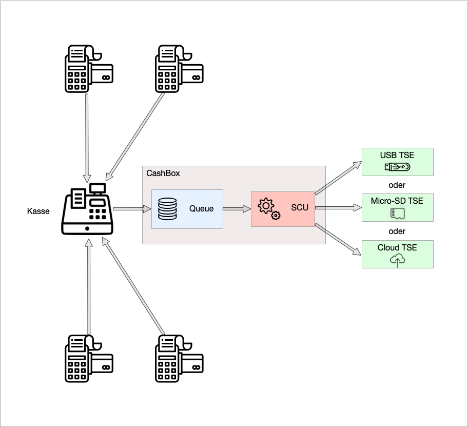

Eine weitere mögliche Variante dieses Szenario ist die Zuordnung jedes Terminals zu einer eigenen fiskaltrust.Queue.

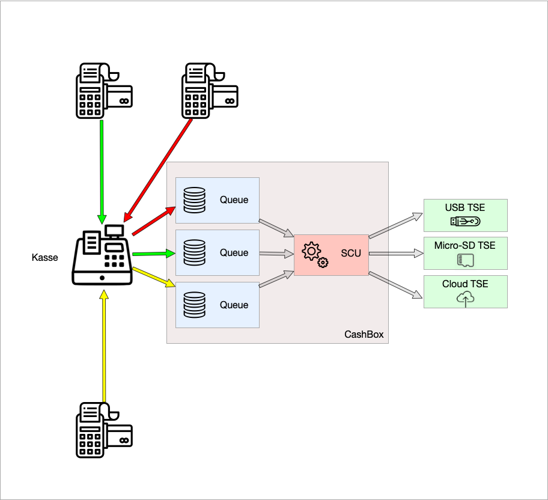

## Rechenzentrum als operational environment
Falls die Kasse in einem Rechenzentrum betrieben wird und die Terminals ohne (Internet-)Verbindung zu diesem nicht funktionsfähig sind, kann das Rechenzentrum unter bestimmten Voraussetzungen als "operational environment" angenommen werden. Die fiskaltrust.Middleware sollte in diesem Fall vollständig im Rechenzentrum betrieben werden. In diesem Szenario verbinden sich die Terminals über das Online Kassensystem zur fiskaltrust.Middleware im Rechenzentrum.
Im Falle eines Ausfalls der (Internet-)Verbindung ist es allerdings so, dass die fiskaltrust.Middleware nicht mehr erreicht werden kann und somit keine von der fiskaltrust.Middleware erzeugten Signaturen auf die Belege gedruckt werden können. Bei Interesse an dieser Lösung (BYOD), bei der die fiskaltrust.Middleware im Rechenzentrum des Kassenbetreibers läuft, helfen wir Ihnen gerne weiter. Kontaktieren Sie uns hierzu bitte unter: [info@fiskaltrust.de](mailto:info@fiskaltrust.de?subject=Informationen%20zu%20Bring-your-own-datacenter).

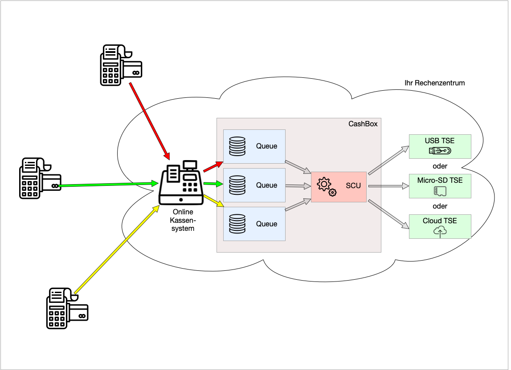

## Anbindungsvarianten der TSE and die SCU

Für folgende Anbindungsvarianten haben wir eine Legende vorbereitet, die die Bedeutung der einzelnen Pfeile aufzeigt:

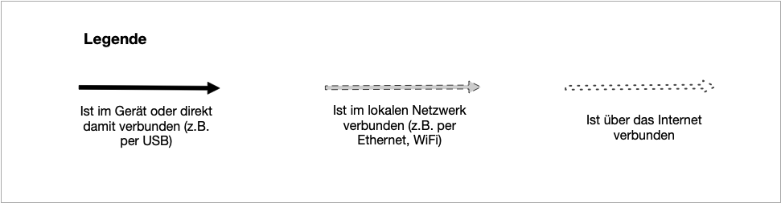

### Kasse mit Hardware-TSE
In der klassischen Anbindungsvariante befindet sich das Kassensystem in der lokalen Umgebung des Standorts und eine Hardware-TSE ist direkt mit dem Kassensystem verbunden z.B. über USB oder micro SD.

### Netzwerk-Drucker mit Hardware-TSE
Eine weitere Variante in der lokalen Umgebung stellt die Verwendung eines Netzwerk-Druckers mit Hardware-TSE dar. Dabei kann die Hardware-TSE direkt in dem Drucker integriert oder per USB angeschlossen sein. Eine oder mehrere Kassen verwenden den Drucker.

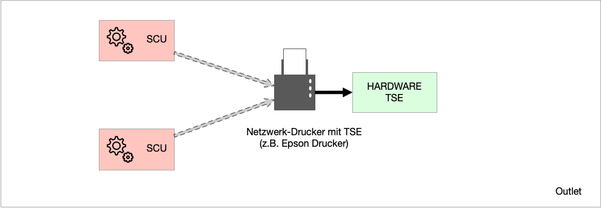

### Lokaler TSE-Server mit Hardware-TSEs
Die dritte Anbindungsvariante in der lokalen Umgebung wird über einen TSE Server im lokalen Netzwerk realisiert. An einen TSE-Server können mehrere Hardware-TSE angeschlossen werden. Mehrere Kassen greifen über Ihre fiskaltrust SCU auf den TSE-Server zu.

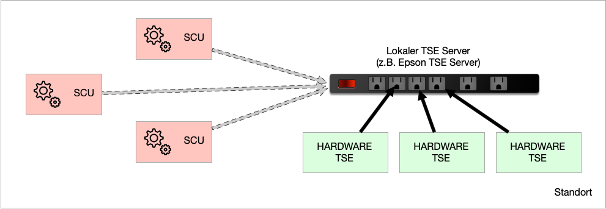

### Kasse mit Cloud-TSE
Auf eine Cloud-TSE muss über das Internet zugegriffen werden. In folgendem Szenario greift eine Kasse mit Hilfe der fiskaltrust SCU auf eine Cloud-TSE über das Internet zu.

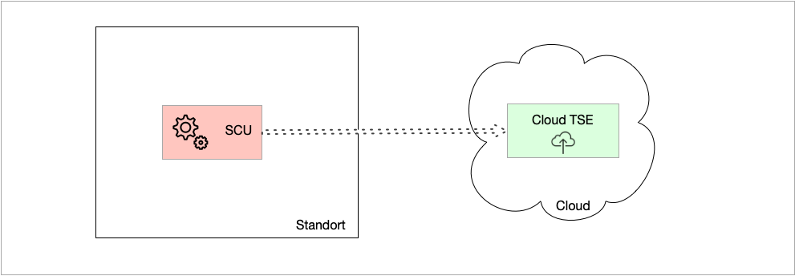

### Kassensystem im Rechenzentrum des Betreibers mit Cloud-TSE

Auch hier greift das Kassensystem mit Hilfe der fikalterust SCU über das Internet auf eine Cloud-TSEs zu. In der lokalen Umgebung befinden sich lediglich Terminals ohne Kassenfunktion die über das Internet auf das elektronische Kassensystem im Rechenzentrum des Betreibers zugreifen.

## Lösungsvorschläge zur Virtualisierung innerhalb eines Standortes

Bei einer Virtualisierung des elektronischen Kassen- oder Aufzeichnunsgsystem inklusive fiskaltrust.Middleware treten erfahrungsgemäß Probleme bei Zugriff auf eine direkt am lokalen Server angebundene Hardware-TSE über USB oder als micro SD auf. Eine Ausnahme stellt hierbei die Diebold-Nixdorf-TSE dar, da die Kommunikation mit dieser über COM-Port stattfindet. Aufgrund der zuvor genannten Zugriffsprobleme, haben wir in folgenden Skizzen Lösungssvorschläge für dieses Szenario dargestellt. Statt der Anbindung einer Hardware-TSE direkt am lokalen Server empfehlen wir folgende Optionen:

### SCU ist innerhalb der virtuellen Instanz

- Anbindung an einen lokale Netzwerk-Drucker mit TSE
- Anbindung an einen TSE-Server im lokalen Netzwerk
- Anbindung von Cloud-TSEs (sobald zertifiziert)
- Anbindung an eine Diebold-Nixdorf Hardware-TSE, da die Kommunikation hierbei über COM-Port stattfindet

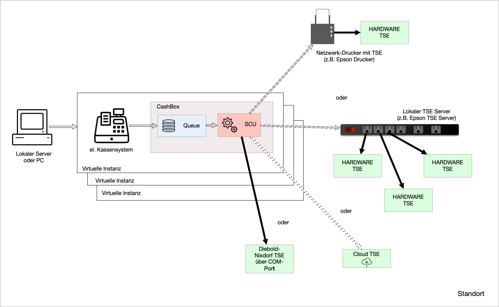

### SCU ist außerhalb der virtuellen Instanz

Die fiskaltrust.Middleware läuft bei dieser Option auf einem zweiten lokaler Server. Sie wird hier nicht in einer virtualisierten Umgebung betrieben. Die hierbei verwendete CashBox konfiguriert lediglich eine SCU, die auf die Hardware-TSE zugreift. Die Hardware-TSE wird direkt an diesen, zweiten Server, per USB oder micro-SD angeschlossen. Im ersten Server, in dem die virtuellen Instanzen laufen, konfigurieren die eingesetzen CashBoxen die fiskaltrust.Middelware Instanzen so, dass nur sie jeweils nur eine Queue betreiben, die der SCU im zweiten Server zugerodnet wird.

Eine mögliche Optimierung der oben beschriebenen Option könnte sein, dass die fiskaltrust.Middleware, die die SCU beinhaltet auf dem gleichen Server läuft wie die virtuellen Instanzen, jedoch nicht virtualisiert ist. Diese kann auf die Hardware-TSE zugreifen.

