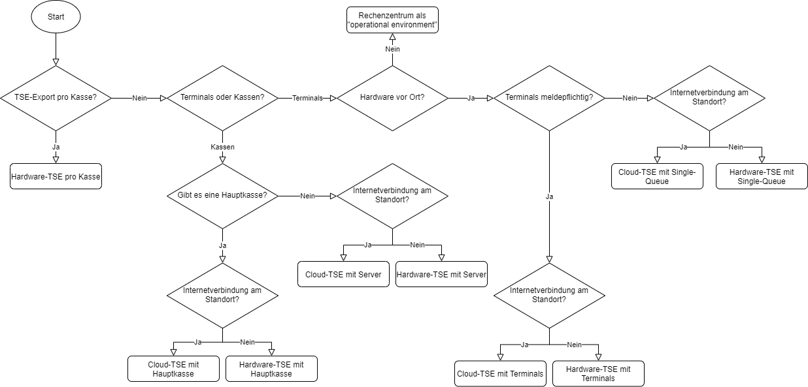
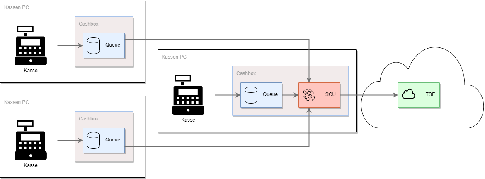
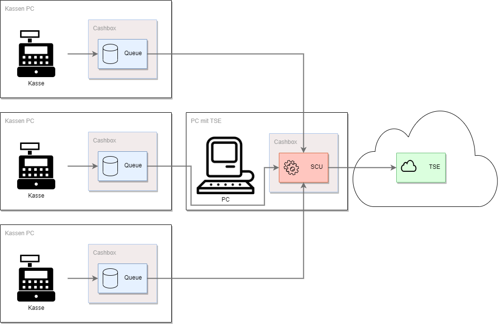
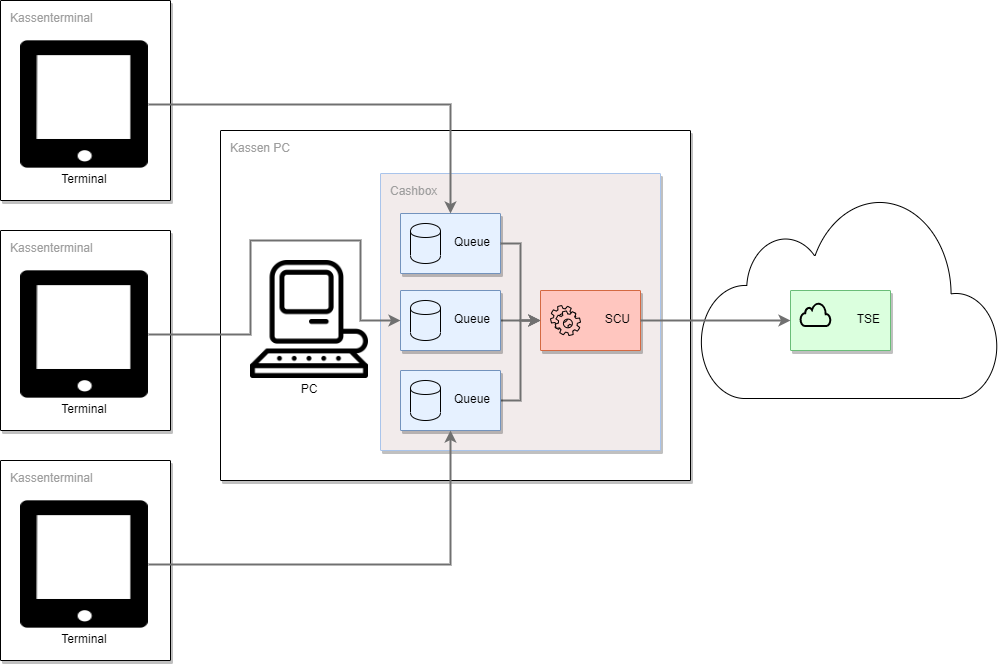
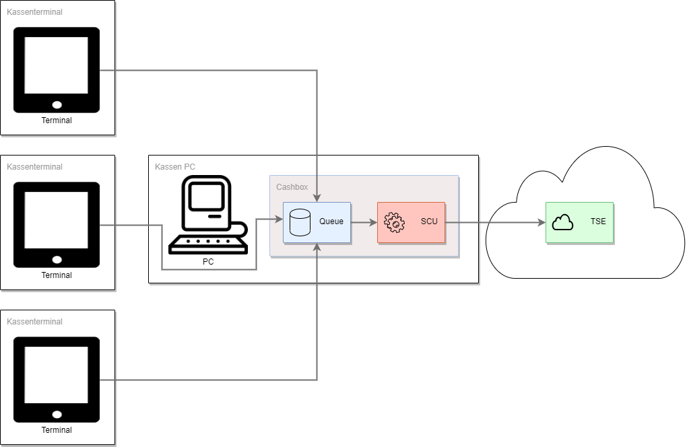

# Rollout Szenarien, Tipps & Tricks für DE
Um die fiskaltrust.Middleware in Verbindung mit Kassen und TSEs zu verwenden kommen unterschiedliche Szenarien in Frage. Bei jedem dieser Szenarien handelt es sich immer um einen Standort. Diese werden weiter unten erläutert, es gibt allerdings einige Grundvoraussetzungen welche auf jeden Fall gegeben sein müssen, unabhängig vom Szenario.

- Pro POS-System (Standort) muss mindestens eine [SCU](https://github.com/fiskaltrust/productdescription-de-doc/blob/master/product-service-description/compliance-as-a-service/features/SCU-Abstraktion.md) inkl. TSE zugeordnet sein. Die TSE kann entweder eine Hardware TSE vor Ort sein, oder eine zertifizierte Cloud TSE.
- Jede Kasse welche dem Finanzamt gemeldet werden muss, muss eine Queue zugeordnet sein.

#### TSE in der Cloud
Mit einer Cloud TSE können diverse Komponenten der TSE in einem Rechenzentrum betrieben werden. Ist die TSE nicht mehr erreichbar, wechselt die fiskaltrust.Middleware in den Ausfallsmodus. Bei der Nutzung von Cloud TSEs möchten wir auf die [Fair-Use-Policy]() hinweisen.

#### Hardware-TSE
Wird eine Hardware-TSE genutzt, so muss pro Kasse nur eine angeschlossen werden. Entweder per SD-Karte oder am USB-Anschluss.

## Entscheidungshilfe
Dieser Leitfaden stellt eine Entscheidungshilfe dar, welches Szenario für welche Gegebenheiten empfohlen wird. Die Fragen werden nachfolgend genauer beschrieben.

#### TSE-Export pro Kasse?
Ja bedeutet, dass die Exporte der TSE immer ausschließlich direkt an der Kasse erfolgen. Das Exportieren und auch das Löschen der Daten auf der TSE ist hier technisch am einfachsten. Pro Kasse wird also eine TSE verwendet, das ist die maximale Anzahl.

#### Terminals oder Kassen?
"Terminals" bedeutet, die Eingabegeräte sind Tablets oder ähnliches, das heißt es ist gar nicht möglich hier eine Hardware-TSE anzuschließen bzw. die fiskaltrust.Middleware am Gerät selbst zu installieren. Bei "Kassen" handelt es sich um Geräte an denen die fiskaltrust.Middleware installiert werden kann.

#### Gibt es eine Hauptkasse?
Ja bedeutet, dass eine der Kassen als Hauptkasse genutzt wird. Die Hauptkasse muss demnach eingeschalten sein damit die anderen Kassen auf die TSE zugreifen können. Bei Nein wird die fiskaltrust.Middleware welche mit der TSE kommuniziert auf einem lokalem PC (Server) installiert.

#### Hardware vor Ort?
Nein bedeutet, es nicht möglich Hardware (mit Ausnahme der Eingabeterminals) vor Ort zu betreiben.

#### Terminals meldepflichtig?
Ja bedeutet, dass die Terminals dem Finanzamt gemeldet werden. Ist das der Fall, benötigt jedes Terminal eine eigene fiskaltrust.Queue. 

#### Internetverbindung vorhanden?
Ja beduetet, dass eine Internetverbindung vor Ort vorhanden ist.

#### Links zu den Szenarien

- [Hardware-TSE pro Kasse](#Hardware-TSE-pro-Kasse)
- [Cloud-TSE mit Hauptkasse](#Cloud-TSE-mit-Hauptkasse)
- [Hardware-TSE mit Hauptkasse](#Hardware-TSE-mit-Hauptkasse)
- [Cloud-TSE mit Server](#Cloud-TSE-mit-Server)
- [Hardware-TSE mit Server](#Hardware-TSE-mit-Server)
- [Cloud-TSE mit Terminals](#Cloud-TSE-mit-Terminals)
- [Hardware-TSE mit Terminals](#Hardware-TSE-mit-Terminals)
- [Cloud-TSE mit Single-Queue](#Cloud-TSE-mit-Single-Queue)
- [Hardware-TSE mit Single-Queue](#Hardware-TSE-mit-Single-Queue)
- [Rechenzentrum als operational environment](#Rechenzentrum-als-operational-environment)

## Hardware-TSE pro Kasse

## Cloud-TSE mit Hauptkasse
An der Hauptkassa wird eine fiskaltrust.CashBox betrieben welche eine fiskaltrust.Queue und die SCU enthält und diese kommuniziert mit der Cloud-TSE. Auf den anderen Kassen sind dennoch fiskaltrust.CashBoxen installiert, welche allerdings nur eine fiskaltrust.Queue haben und mit der SCU verbunden sind. Alle Komponenten (mit Ausnahme von Teilen der Cloud-TSE) befinden sich am gleichen Standort, im sogenannten "operational environment" (sichere Einsatzumgebung).

## Hardware-TSE mit Hauptkasse
An der Hauptkassa wird eine fiskaltrust.CashBox betrieben welche eine fiskaltrust.Queue und die SCU enthält und diese kommuniziert mit der TSE. Auf den anderen Kassen sind dennoch fiskaltrust.CashBoxen installiert, welche allerdings nur eine fiskaltrust.Queue haben und mit der SCU verbunden sind. Alle Komponenten befinden sich am gleichen Standort, im sogenannten "operational environment" (sichere Einsatzumgebung). Bei diesem Szenario ist darauf zu achten, dass die Exporte aller Kassen zentral auf einer TSE stattfinden und es beim Export und dem Löschen der Daten zu Problemen führen kann.

## Cloud-TSE mit Server
Am Server wird eine fiskaltrust.CashBox betrieben welche die SCU enthält und diese kommuniziert mit der Cloud-TSE. Auf den Kassen sind dennoch fiskaltrust.CashBoxen installiert, welche allerdings nur eine fiskaltrust.Queue haben und mit der SCU verbunden sind. Alle Komponenten (mit Ausnahme von Teilen der Cloud-TSE) befinden sich am gleichen Standort, im sogenannten "operational environment" (sichere Einsatzumgebung).

## Hardware-TSE mit Server
Am Server wird eine fiskaltrust.CashBox betrieben welche die SCU enthält und diese kommuniziert mit der TSE. Auf den anderen Kassen sind dennoch fiskaltrust.CashBoxen installiert, welche allerdings nur eine fiskaltrust.Queue haben und mit der SCU verbunden sind. Alle Komponenten befinden sich am gleichen Standort, im sogenannten "operational environment" (sichere Einsatzumgebung). Bei diesem Szenario ist darauf zu achten, dass die Exporte aller Kassen zentral auf einer TSE stattfinden und es beim Export und dem Löschen der Daten zu Problemen führen kann.

## Cloud-TSE mit Terminals
Werden die Kassen nur als Eingabeterminals verwendet, so ist es nicht notwendig eine fiskaltrust.CashBox an der Kasse zu installieren. Das ist auch möglich wenn es keine Kassen gibt, sondern nur Terminals (zum Beispiel Tablets) welches als Eingabeterminals fungieren. Da die Terminals/Kassen dem Finanzamt gemeldet werden benötigt jede Kasse/jedes Terminal eine fiskaltrust.Queue. 

## Hardware-TSE mit Terminals
Werden die Kassen nur als Eingabeterminals verwendet, so ist es nicht notwendig eine fiskaltrust.CashBox an der Kasse zu installieren. Das ist auch möglich wenn es keine Kassen gibt, sondern nur Terminals (zum Beispiel Tablets) welches als Eingabeterminals fungieren. Da die Terminals/Kassen dem Finanzamt gemeldet werden benötigt jede Kasse/jedes Terminal eine fiskaltrust.Queue.

## Cloud-TSE mit Single-Queue
Werden die Kassen nur als Eingabeterminals verwendet, so ist es nicht notwendig eine fiskaltrust.CashBox an der Kasse zu installieren. Das ist auch möglich wenn es keine Kassen gibt, sondern nur Terminals (zum Beispiel Tablets) welches als Eingabeterminals fungieren. Da die Terminals/Kassen dem Finanzamt nicht gemeldet werden kann alles in eine fiskaltrust.Queue laufen.

## Hardware-TSE mit Single-Queue
Werden die Kassen nur als Eingabeterminals verwendet, so ist es nicht notwendig eine fiskaltrust.CashBox an der Kasse zu installieren. Das ist auch möglich wenn es keine Kassen gibt, sondern nur Terminals (zum Beispiel Tablets) welches als Eingabeterminals fungieren. Da die Terminals/Kassen dem Finanzamt nicht gemeldet werden kann alles in eine fiskaltrust.Queue laufen.

## Rechenzentrum als operational environment
Falls die Kasse in einem Rechenzentrum betrieben wird und die Eingabestationen ohne (Internet-)Verbindung zu diesem nicht funktionsfähig sind, kann das Rechenzentrum unter bestimmten Voraussetzungen als "operational environment" angenommen werden. Die fiskaltrust.Middleware kann in diesem Fall vollständig in diesem Rechenzentrum betrieben werden. In diesem Szenario verbinden sich die Terminals (Eingabestationen) zur fiskaltrust.Middleware im Rechenzentrum.
Im Falle eines Ausfalls der (Internet-)Verbindung ist es allerdings so, dass keine SignatureItems auf die Belege gedruckt werden können. Bei Interesse zur Lösung, bei der fiskaltrust den Betrieb im Rechenzentrum des KassenBetreibers installiert und wartet, gibt er hier mehr Informationen: [info@fiskaltrust.de](mailto:info@fiskaltrust.de?subject=Informationen%20zu%20Bring-your-own-datacenter).

