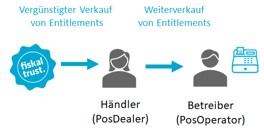

# Vertriebsmodell für Kassenhändler

fiskaltrust ist ein Software-Unternehmen, welches sich auf die Entwicklung von compliance-as-a-service Produkten für Kassenhersteller und Kassenhändler innerhalb Europas konzentriert.

Der Vertrieb der fiskaltrust.Produkte und Produkt-Bundles erfolgt in partnerschaftlicher Zusammenarbeit mit den Kassenhändlern. Durch die Nutzung bestehender Vertriebsstrukturen von Kassenhändlern in den jeweiligen Ländern, kann den Kassenbetreibern ein Produktportfolio angeboten werden, welches die individuellen Bedürfnisse eines jeden einzelnen Kassenbetreibers berücksichtigt und erfüllt.

Zur Unterstützung des Vertriebes stellt fiskaltrust für Kassenhändler folgende Sammlung aus Unterlagen, Informationen, Vorlagen und Dokumentationen zur Verfügung:

## Pre-Sales Bereich

Der Pre-Sales Bereich unterstützt Händler vom ersten Berührungspunkt mit fiskaltrust. Er enthält alle Informationen, Materialien und Guidelines um es dem Händler zu ermöglichen, seine Kunden zu beraten und die Produkte von fiskaltrust weiterzuverkaufen.

- [Preisliste für Händler, Unterlagen und Informationen zu fiskaltrust.Produkten](02-pre-sales/haendler-preisliste.md) 
- Vorlagen & Produkt-Material zur freien Verwendung für den eigenen Vertrieb (Marktkommunikation) 
- [Rollout Szenarien Planung, Tipps & Tricks](03-sales/rollout-scenarios.md)

## Sales & Rollout Bereich

Der Sales-Bereich beinhaltet Unterstützung im Verkaufs- und Rollout-Prozess, angefangen vom Einkauf der Händler-Packages bis zu Wiederverkäufen. Sie finden weiters Informationen zu (Massen-)Einladungen für Kassenbetreiber, zu  Konfigurations- und Rollout-Management und auch zur Inbetriebnahme der fiskaltrust.Middleware.

- [Entitlements - Geschäftsmodell für Kassenhändler](03-sales/README.md)
- Templates & Corporate Branding
- Dokumentationen zur Einladung & Verwaltung der Kunden über das fiskaltrust.Portal

## After-Sales Bereich

Der After-Sales Bereich bietet Unterstützung für Händler nach erfolgreichem Abschluß des Rollouts, angefangen bei Hilfestellungen im Kundensupport, über Produkt-updates bis hin zur Erneuerung der Subscriptions. 

- TSE Verwaltung
- Vertragsmanagement
- Hilfestellung für Kundensupport
