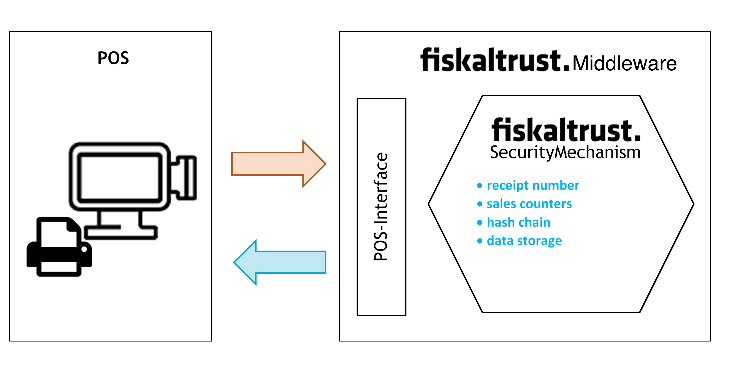
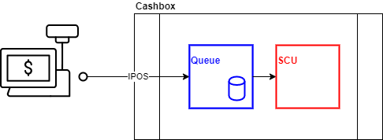

# fiskaltrust.Leistungsbeschreibung

fiskaltrust ist ein Softwarehersteller und entwickelt für Kassenhersteller und Kassenhändler Compliance-as-a-Service und Revisionssichere-Daten-as-a-Service Produkte.

## Compliance-as-a-Service

Als Poscreator erhalten Sie Compliance-as-a-Service, indem Sie fiskaltrust in Ihr Produkt integrieren. Durch die Übermittlung jedes Beleges, jeder Transaktion oder jeder relevanten Aktion an die fiskaltrust-Middleware vor deren Abschluss wird diese Konformität als Service bereitgestellt. Die fiskaltrust-Middleware bietet eine stabile Schnittstelle zu verschiedenen Technologien für das vom Poscreator erstellte Possystem und bietet einen einfachen Berührungspunkt zwischen Possystem und Fiskaltrust-Middleware.

                                

Diese Lösung macht die fiskaltrust-Middleware zu einem wesentlichen Bestandteil des Possystems und damit auch zu dessen Instanz zur Registrierkasse.

Die fiskaltrust-Middleware verarbeitet einige der wichtigsten Datenfelder auf dem Beleg. Die Belegnummer als eindeutige Identifikation eines von der Registrierkasse übermittelten Beleges wird von der fiskaltrust-Middleware erstellt, um sicherzustellen, dass jeder Beleg von ihr verarbeitet wird.

Die Konformität wird durch die Kombination mehrerer Methoden und Komponenten erreicht.

Zunächst stellt die fiskaltrust-Middleware sicher, dass alle Belege von einem Dritten neben dem Poscreator und dem Posoperator verarbeitet werden. Dies ist die organisatorische Implementierung der Sicherheit.

Als technische Implementierung der Sicherheit wird jeder Request und auch jede Response gehasht, wodurch die Datenintegrität der Anforderungen und Antworten sichergestellt wird. Um Unveränderlichkeit zu gewährleisten, wird ein weiterer Hash-Wert generiert, der sich auf den gesamten Anforderungs-Antwort-Zyklus bezieht, einschließlich der Identifizierung des Zyklus, des Betriebszeitpunkts, der vom Menschen lesbaren Belegnummer und der Hash-Werte von Anforderung, Antwort und vorherigem Empfang, der so genannte Belegs-Hash-Wert. Diese Verkettung des Empfangs-Hash-Werts bietet Unveränderlichkeit und bietet die Möglichkeit, alle Änderungen und auch das Löschen bei jeder vom Possystem bereitgestellten Aktion zu erkennen.

 

 

Um das Risiko eines Angriffs auf die Kette ab dem letzten nicht verketteten Hashwert zu begrenzen, bietet fiskaltrust einen Mechanismus, der die aktuellen Daten in die fiskaltrust-Cloud spiegelt. Dieser Datenspiegel bietet die Möglichkeit, Angriffe zu erkennen, die an der Registrierkasse selbst nicht erkennbar wären.

Als letzte Komponente des fiskaltrust-Sicherheitsmechanismus bietet die fiskaltrust-Middleware auch marktbezogene Sicherheitsmechanismen.

Um für verschiedene Plattformen und Betriebssysteme so offen wie möglich zu sein und das Versprechen zu erfüllen, als stabile Schnittstelle zum Possystem zu fungieren, folgt die fiskaltrust-Middleware einer strengen Architektur.

 

  

 

Der von der CashboxId identifizierte Konfigurationscontainer kann in verschiedene Plattformen und Betriebssysteme integriert werden. Die Verwaltung der Konfiguration und des Status dieser Komponenten erfolgt im marktbezogenen fiskaltrust-Portal. Der fiskaltrust-Sicherheitsmechanismus wird von der Queue-Komponente und der SCU-Komponente (Signaturerstellungseinheit) bereitgestellt, die die Bindung an die marktbezogenen Sicherheitsmechanismus-Anforderungen darstellen.

# Revisionssichere Daten-as-a-Service

Kassenbetreiber erhalten revisionssichere Daten-as-a-Service, indem sie ein Pos-System verwenden, das die fiskaltrust.Middleware enthält. 

## fiskaltrust-cloud

Die fiskaltrust cloud befindet sich in einer tiefen Integration mit der fiskaltrust-Middleware, die die Daten als Teil des Sicherheitsmechanismus in die cloud spiegelt. Die Datenintegrität wird durch den Hash-Wert der Requests und Responses sichergestellt, und die Vollständigkeit kann durch Nachverfolgung der Kassenbeleg-Hash-Kette überprüft werden. Dies bedeutet, dass alle Originaldatensätze erhalten bleiben und unveränderlich sind. Der Schutz vor Datenverlust wird durch eine Lösung mit standortverteilten Daten-Speichern gewährleistet. Die Daten werden – entsprechend den steuerlichen Bestimmungen – in deutschen Rechenzentren gespeichert.

## POS Archiv

Das POS Archiv speichert Daten, basierend auf die übermittelten Belege über die fiskaltrust.Middleware, über einen Zeitraum von 10 Jahren. Zu diesem Zeitpunkt wird auch das spezielle Journal der erstellten unterschriebenen Geldeingänge abgedeckt.

Bei Auftreten einer monatlichen Quittung wird ein Datencheck zur Konsistenz durchgeführt und eine zusätzliche Exportdatei erstellt und auf einem unveränderlichen Speicher in der fiskaltrust-Cloud gespeichert.

[PDF Download der Leistungsbeschreibung](media/leistungsbeschreibung.pdf)