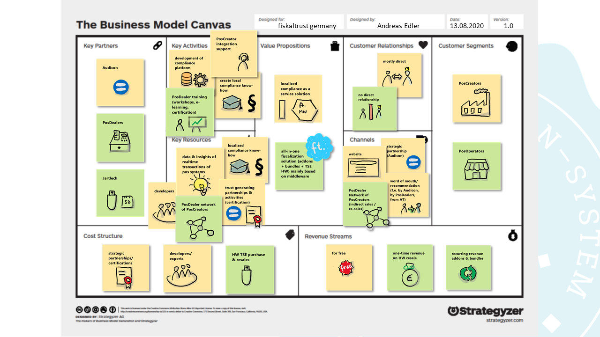

# Das Geschäftsmodell von fiskaltrust in Deutschland

## Business Model Canvas

[Download der Schritt-für-Schritt Präsentation des Geschäftsmodelles im Powerpoint-Format](media/business-model-market-de.pptx).

### Valuestream der fiskaltrust.Middleware

fiskaltrust bietet in Deutschland eine für den deutschen Markt angepasste Compliance-as-a-Service Lösung für KassenHersteller an. 

Diese wird als fiskaltrust.Middleware über den strategischen Partner in Deutschland, der Audicon GmbH, bzw. über die Webseite von fiskaltrust und über Empfehlungen bestehender Kunden vertrieben. 

Die fiskaltrust.Middleware ist kostenlos, um eine möglichst hohe Verbreitung am Markt zu erreichen.

fiskaltrust pflegt direkten Kontakt mit KassenHerstellern, um diese bei der Integration der fiskaltrust.Middleware zu unterstützen. Zu den weiteren Schlüsselaktivitäten zählen der Erwerb und Erhalt von Know-How im Bereich Fiskalisierung sowie deren rechtliche Bestimmungen (Gesetze, Verordnungen, usw.), und die Entwicklung der benötigten Fiskalisierungsplattform.

Das Fiskalisierungs-Know-How, vertrauensbildende Maßnahmen wie Zertifizierungen und strategische Partnerschaften, sowie das Wissen um die Verwendung der Kassen- und Aufzeichnungssysteme zur kontinuierlichen Verbesserung des Produktangebotes, zählen zu den wichtigsten Ressourcen von fiskaltrust.

Die größten Ausgaben entstehen durch Developer, Experten sowie strategische Partnerschafte und Zertifizierungen.

### Valuestream der All-in-one-Fiskalisierungslösungen

Zusätzlich zur fiskaltrust.Middleware bietet fiskaltrust noch All-in-one-Fiskalisierungslösungen für KassenBetreiber an, welche überwiegend auf die von den KassenHerstellern integrierte fiskaltrust.Middleware aufsetzen - wie etwa Addons oder Produktbundles inklusive (Hardware) TSE.

Der Vertrieb erfolgt hierbei ausschließlich über das bestehende Händlernetzwerk des KassenHerstellers, der die fiskaltrust.Middleware bereits integriert hat.

Zu den wichtigsten Einnahmequellen zählen einmalige Einnahmen durch den Wiederverkauf der TSE, sowie wiederkehrende jährliche Einnahmen durch Entitlements (Ansprüche der KassenHändler auf ein Service-Mietmodell für Produkte).

fiskaltrust verkauft die Produkte ausschließlich über KassenHändler und nicht direkt an die Endkunden (KassenBetreiber). Daher kommt es in der Regel zu keinem direkten Kontakt zwischen fiskaltrust und KassenBetreibern.

Um den KassenHändlern den Vertrieb und Support von Produkten von fiskaltrust zu ermöglichen, bietet fiskaltrust Trainings in Form von Workshops/Webinars, sowie Unterlagen in Form von Marketing-, Vertriebs- und Supportmaterialien an.

Das Vertriebsnetzwerk der Händler zählt zu den Schlüsselresourcen für fiskaltrust, die KassenHändler selbst stellen Schlüsselpartner dar.

Jarltech ist der Schlüsselpartner für den Vertrieb der Hardware-TSE, welche im Rahmen der Zwischenfinanzierung für den Wiederverkauf einen wesentlichen Anteil der Kosten in diesem Valuestream einnehmen.