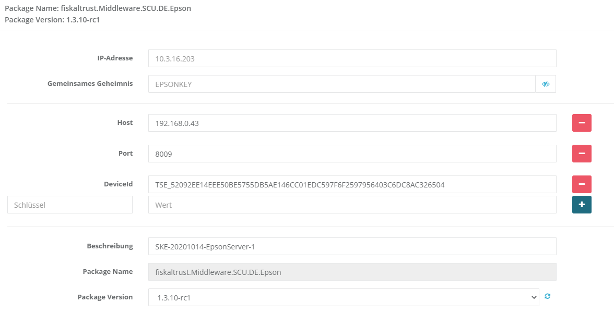

# Epson Interoperabilität

## SCU

Das _fiskaltrust.Middleware.SCU.DE.Epson_-Package ermöglicht die Verbindung der Middleware mit einer Epson-TSE.

**Alpha Version verfügbar ab Version**: 1.3.10-rc1

**Status:** https://github.com/fiskaltrust/roadmap/issues/25

## Parameter

| Name | Beschreibung | Optional |
| ---- | ------------ |--------- |
| _Host_ | Die URL, unter der die TSE erreichbar ist (ohne Port) | nein |
| _Port_ | Der Port, hinter dem die TSE unter der angegebenen URL erreichbar ist. Falls nicht definiert, wird der Standard-Port wie vom Hersteller definiert verwendet. | ja |
| _DeviceId_ | Die für die TSE spezifische Geräte-ID. Falls nicht angegeben, wird der Defaultwert verwendet. | ja |
| _Timeout_ | Timeout-Wert für die Kommunikation mit der TSE in Millisekunden. Falls nicht angegeben, wird der Default-Wert von 60 Sekunden verwendet. | ja |

Bitte achten Sie auf die case-sensitive Verwendung der Parameter.

## Konfiguration

- **Host:** DNS oder IP Addresse des Epson Servers, Epson Printers oder lokalen Webservices
- **Port:** Port des Epson Servers, Printers oder lokjalen Webservices, üblicherweise 8009
- **DeviceId:** Diese Einstellung ist nur für den Epson Server relevant und dient der Identifikation des Servers. Die DeviceId kann im Epson Server Dashboard gefunden werden, welches über die Host IP Adresse aufgerufen werden kann.

## Troubleshooting:

- Wenn die Developer-TSE einen Selbsttest verlangt obwohl sie aus- und eingesteckt wurde, führen Sie bitte an der Developer-TSE einen Factory-Reset gemäß den Hersteller-Angaben durch.
- Bei der Verwendung einer USB Epson-TSE direkt an der Kasse oder am PC stellen Sie bitte sicher, dass der dafür benötigte Treiber von Epson installiert ist. Diesen können Sie unter folgender URL beziehen: https://download.epson-biz.com/modules/pos/index.php?page=single_soft&cid=6566&pcat=13&pid=6397 Dies gilt nicht für die Verwendung der USB Epson TSE in einem Epson-Server.
- Für einen Einsatz am Printer werden von Epson ausschließlich MicroSD Epson TSE unterstützt. USB Epson TSE funktionieren an einem Printer nicht.

## Pilotinstallation

Für die Finalisierung der Epson TSE Implementierung suchen wir Partner für eine Pilotinstallation.

### Rahmenbedingungen

- Abgeschlossene oder kurz vor dem Abschluss stehende Implementierung der Middleware
- Registrierung am (Produktiv) Portal als PosCreator oder PosDealer
- Registrierung am Sandbox Portal und trial-configuration knowledge
- Partner bezieht die TSE Hardware für den zukünftigen Rollout über fiskaltrust

### Teilnahme an der Pilotinstallation

Bitte kontaktieren Sie [support@fiskaltrust.de](mailto:support@fiskaltrust.de) für die Teilnahme am Epson-TSE-Pilotprojekt, vielen Dank!

## Hardware

### Epson TSE, USB

**Artikel Nummer:** 4445-21500                     

Technische Sicherungseinrichtung (TSE-Modul), Bauform: Nano-USB-Stick, Lebensdauer: 20 Mio. Signaturen, Zertifikatslaufzeit: 5 Jahre

Sonderartikel: Storno und Rückgabe unabhängig von der Lieferzeit ausgeschlossen.

### Zertifizierungs-ID

Zertifizierungs-ID der TSE gemäß Punkt 9.2.2 des [Anwendungserlasses zu § 146a AO](https://docs.fiskaltrust.cloud/doc/productdescription-de-doc/product-service-description/media/2019-06-17-einfuehrung-paragraf-146a-AO-anwendungserlass-zu-paragraf-146a-AO.pdf):

|   Zertifizierungs-ID |   Prüfgegenstand |   Antragsteller |   Datum |
| :----------------------------------------------------------- | :----------------------------------------------------------- | :----------------------------------------------------------- | :----------------------------------------------------------- |
| [BSI-K-TR-0373-2019](https://www.bsi.bund.de/SharedDocs/Zertifikate_TR/Technische_Sicherheitseinrichtungen/BSI-K-TR-0373-2019.html) | EPSON USB TSE, Vers. 1.0 EPSON microSD TSE, Vers. 1.0        | Epson Europe BV                                              | 20.12.2019                                                   |

### Preis & Vertrieb

[fiskaltrust.Portal](https://portal.fiskaltrust.de)