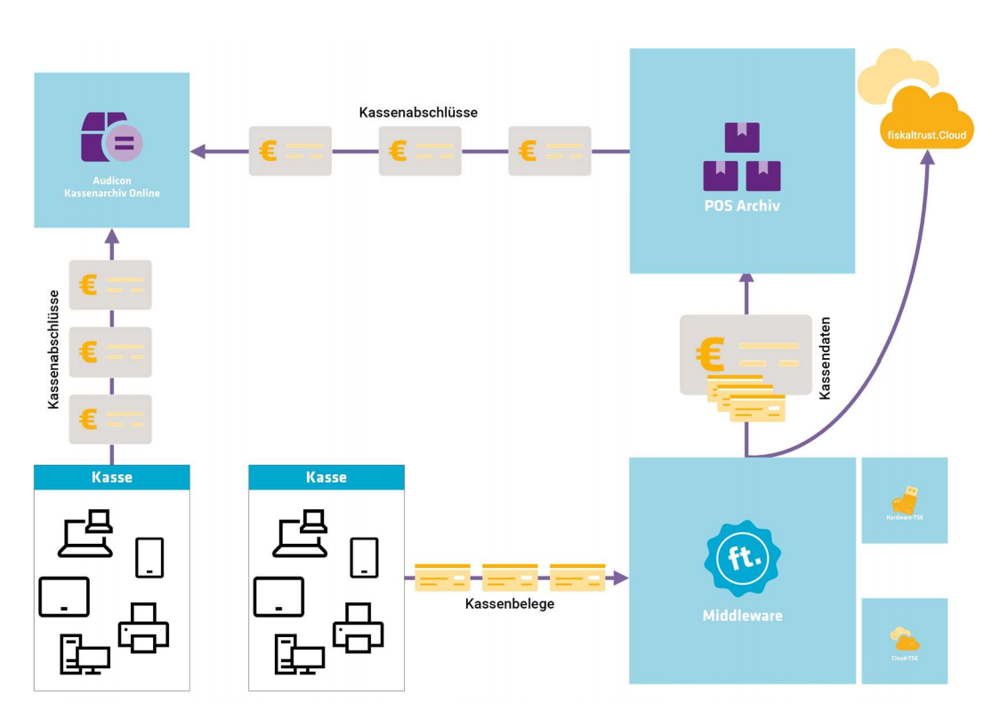

# Revisionssichere Daten as a Service Produkte

|  | POSArchiv | AKO |
| --- | --- | --- |
| Speichern der Belegdaten | X |  |
| Speichern der Kassenabschlüsse | X | X |
| revisionssichere Belege | X |  |
| Belegsicherung in der Cloud | X | X |
| tar-File Export | X |  |
| DSFinV-K Export | X | X |
| DATEV/DEFKA Export | X |  |

- [POS Archiv](pos-archiv.md) 
  - *Speichern der Belegdaten* erfolgt automatisch und revisionssicher aus den Daten die von der fiskaltrust.Middleware verarbeitet wurden.
  - *Zentraler Export über das fiskaltrust.Portal* - TSE-TAR File Export, DSFinV-K und DFKA Export.
  - *Server zu Server Kommunikation* - die Kassenabchlussdaten werden zum DATEV Kassenarchiv online und zum Audicon Kassenarchiv Online (AKO) automatisch übertragen.

- [Audicon Kassenarchiv Online](Audicon-Kassenarchiv-Online.md) 

  - *Revisionssicherer Speicher* für DSFinV-K Files (Tagesabschlüsse), TSE-TAR Files, PDF Files (z.B. Verfahrensdokumentation) über 12 Jahre.
  - *Hochladen der Daten* manuell oder über die zur Verfügung gestellte API.
  - *Kundenbindung für Kassenhändler* Kassenbetreiber speichert seine Daten über die Webseite des Kassenhändlers (einfache Integration des Uploadmoduls in die Webseite).
  - *Web-Portal* ermöglicht mandantenfähigen Zugriff auf die hochgeladenen Daten. Der Kassenhändler kann bei Bedarf auf diese Daten zugreifen und diese im Falle einer Steuerprüfung für den Kassenbetreiber exportieren.
  - *Automatische Prüfung* des Datenformats von DSFInV-K und TSE-TAR Files und Zuordnung zum Kassenbetreiber.
  - *Unabhängig* von der fiskaltrust.Middleware können Daten von jeder Kasse gespeichert werden.
